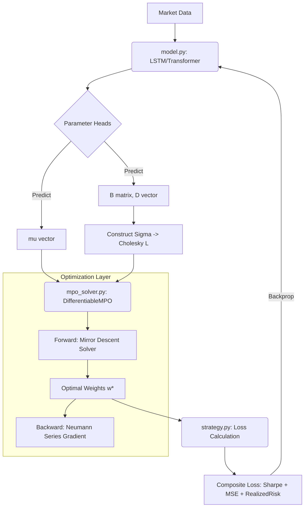

# Diff-MPO 算法实现文档

## 1. 算法概述

**Diff-MPO (Differentiable Multi-Period Optimization)** 是一个基于深度学习的端到端投资组合优化框架。与传统的“先预测，后优化”（Predict-then-Optimize）范式不同，Diff-MPO 将凸优化问题建模为神经网络中的一个**可微层 (Differentiable Layer)**。

这种架构允许梯度（Gradient）从最终的投资组合绩效（如夏普比率、已实现风险）直接反向传播到神经网络的参数中。换句话说，模型不仅仅是在学习如何准确预测未来的资产收益率，更是在学习**如何构建一个最优的投资组合**。

### 核心特性
*   **端到端学习 (End-to-End Learning)**：直接优化决策目标。
*   **因子模型协方差 (Factor Model Covariance)**：使用低秩结构化协方差矩阵，降低估计误差。
*   **可微 CVaR 约束 (Differentiable CVaR)**：将条件在险价值（CVaR）作为软约束嵌入优化目标。
*   **隐函数微分 (Implicit Differentiation)**：利用隐函数定理和 Neumann 级数高效计算优化层梯度。

---

## 2. 数学模型详解

Diff-MPO 在每一个决策时刻 $t$，求解一个 $H$ 步的多周期规划问题。为了便于说明，我们以单步优化为例，其核心目标函数 $F(w)$ 定义如下：

$$
\min_{w \in \mathbb{R}^N} \quad F(w) = \underbrace{J_{\text{Ret}}(w)}_{\text{收益}} + \underbrace{J_{\text{Risk}}(w)}_{\text{风险}} + \underbrace{J_{\text{Cost}}(w)}_{\text{成本}} + \underbrace{J_{\text{CVaR}}(w)}_{\text{CVaR惩罚}}
$$

### 2.1 目标函数子项

#### (1) 收益最大化项 (Return Maximization)
$$ J_{\text{Ret}}(w) = - \mu^T w $$
*   **含义**：最大化预期收益 $\mu^T w$ 等价于最小化其负值。
*   **变量**：$\mu \in \mathbb{R}^N$ 为神经网络预测的资产预期收益率向量。

#### (2) 风险最小化项 (Risk Minimization)
$$ J_{\text{Risk}}(w) = \gamma \cdot w^T \Sigma w = \gamma \cdot \| L^T w \|_2^2 $$
*   **含义**：最小化组合方差。
*   **变量**：
    *   $\Sigma \in \mathbb{R}^{N \times N}$ 为预测协方差矩阵。
    *   $L \in \mathbb{R}^{N \times N}$ 为 $\Sigma$ 的 Cholesky 分解因子 ($\Sigma = L L^T$)，代码中直接使用 $L$ 进行计算以提高数值稳定性。
    *   $\gamma$ (`RISK_AVERSION`)：风险厌恶系数，控制模型对风险的敏感度。

#### (3) 交易成本项 (Transaction Cost)
$$ J_{\text{Cost}}(w) = \lambda_{\text{cost}} \cdot \| w - w_{\text{prev}} \|_1 \approx \lambda_{\text{cost}} \sum_{i=1}^N \sqrt{(w_i - w_{\text{prev}, i})^2 + \epsilon} $$
*   **含义**：惩罚换手率，避免模型过度频繁交易。
*   **优化**：由于 L1 范数 $|x|$ 在 0 点不可导，代码中使用平滑近似 (Smooth L1) 以保证可微性，$\epsilon=10^{-8}$。

#### (4) CVaR 软约束惩罚 (CVaR Soft Penalty)
Diff-MPO 并不将 CVaR 作为硬约束（Hard Constraint），而是将其作为罚函数项：
$$ J_{\text{CVaR}}(w) = \rho \cdot \text{Softplus}\left( \text{CVaR}(w) - \text{Limit} \right) $$

假设资产收益服从正态分布，CVaR 的解析形式为：
$$ \text{CVaR}(w) = -(\mu^T w) + \kappa \cdot \sqrt{w^T \Sigma w} $$
其中 $\kappa = \frac{\phi(\Phi^{-1}(\alpha))}{1-\alpha}$ 是正态分布下的 CVaR 系数。

代码实现形式：
$$ J_{\text{CVaR}} = \rho \sum_{t=1}^H \text{Softplus}\left( -\mu_t^T w_t + \kappa \|L_t^T w_t\|_2 - \text{Limit}, \beta=50 \right) $$
*   **$\rho$ (`CVAR_PENALTY`)**：惩罚强度。
*   **Softplus**：ReLU 的平滑版本 $\frac{1}{\beta}\ln(1+e^{\beta x})$，保证二阶导数存在，利于优化器收敛。

### 2.2 约束条件

优化问题需满足以下两个硬约束：
1.  **预算约束 (Budget Constraint)**：$\sum_{i=1}^N w_{t,i} = 1, \quad \forall t \in \{1, \dots, H\}$
2.  **做多约束 (Long-only Constraint)**：$w_{t,i} \ge 0, \quad \forall t, i$

**代码实现合理性分析**：
Diff-MPO 并不使用拉格朗日乘子法处理这两个约束，而是通过 **变量重参数化 (Reparameterization)** 巧妙解决：
*   在求解器内部，我们维护一个无约束变量 $\log w$。
*   输出时使用 **Softmax** 函数：$w_t = \text{Softmax}(\log w_t)$。
*   **合理性**：Softmax 的输出天然满足 $\sum w_{t,i} = 1$ 且 $w_{t,i} > 0$。这避免了投影操作（Projection）带来的计算开销，且保持了梯度的平滑流动。

### 2.3 多周期联动机制 (Multi-Period Mechanism)

Diff-MPO 的核心在于**一次性规划未来 $H$ 步的最优路径**，而非仅仅优化下一时刻。这种机制通过交易成本项将各个时间步紧密耦合。

#### (1) 轨迹变量 (Trajectory Variable)
求解器的优化变量是一个张量，包含整个预测窗口的权重路径：
$$ W = [w_1, w_2, \dots, w_H] \in \mathbb{R}^{H \times N} $$
其中 $w_t$ 代表第 $t$ 步的投资组合权重。

#### (2) 时间耦合 (Temporal Coupling)
各个时间步并非独立优化，而是通过**交易成本 (Turnover Cost)** 连接：
$$ J_{\text{Cost}}(W) = \lambda_{\text{cost}} \sum_{t=1}^H \| w_t - w_{t-1} \|_1 $$
*   对于 $t=1$，比较对象是当前的实际持仓 $w_{\text{prev}}$ (输入参数)。
*   对于 $t > 1$，比较对象是上一规划步的权重 $w_{t-1}$。

**代码对应** (`mpo_solver.py`):
```python
# w: (Batch, H, N)
# w_shifted: (Batch, H, N), 构造为 [w_prev, w_1, ..., w_{H-1}]
w_shifted = torch.cat([w_prev.unsqueeze(1), w[:, :-1, :]], dim=1)
diff = w - w_shifted
loss_cost = torch.sum(torch.sqrt(diff**2 + 1e-8))
```

#### (3) 模型预测控制 (MPC) 执行逻辑
虽然求解器输出了未来 $H$ 步的最优路径 $[w_1^*, \dots, w_H^*]$，但在实际交易中，我们采用 **MPC (Model Predictive Control)** 策略：
1.  **规划 (Plan)**：基于当前状态 $w_{\text{prev}}$ 和未来 $H$ 步的预测 ($\mu_{1:H}, \Sigma_{1:H}$)，求解最优轨迹。
2.  **执行 (Execute)**：仅执行第一步的决策 $w_1^*$ 作为当天的目标仓位。
3.  **滚动 (Roll)**：到了下一天，接收新的市场信息，更新 $w_{\text{prev}}$ 为昨天的 $w_1^*$，重新规划未来 $H$ 步。

这种机制使得模型能够“**高瞻远瞩**”：为了避免未来某一步的高额调仓成本，模型可能会选择在当前步骤提前进行平滑调整，从而实现长期全局最优。

---

## 3. 变量定义表

以下变量名在 `config.py`, `model.py`, `mpo_solver.py` 中广泛使用：

| 变量名 | 对应数学符号 | 含义 | 维度 (Batch, Horizon, Assets) | 来源/设定 |
| :--- | :--- | :--- | :--- | :--- |
| `mu` | $\mu$ | 预期收益率 | $(B, H, N)$ | 神经网络输出 |
| `L` | $L$ | 协方差 Cholesky 因子 | $(B, H, N, N)$ | 神经网络输出 |
| `w_prev` | $w_{\text{prev}}$ | 上期持仓权重 | $(B, N)$ | 外部输入 / 状态维护 |
| `w` / `w_star` | $w^*$ | 最优投资组合权重 | $(B, H, N)$ | 求解器输出 |
| `gamma` | $\gamma$ | 风险厌恶系数 | Scalar (5.0) | `config.py` |
| `cost_coeff` | $\lambda_{\text{cost}}$ | 交易费率 | Scalar (0.002) | `config.py` |
| `cvar_limit` | Limit | CVaR 上限 | Scalar (0.05) | `config.py` |
| `cvar_penalty` | $\rho$ | 违规惩罚系数 | Scalar (50.0) | `config.py` |
| `kappa` | $\kappa$ | CVaR 统计系数 | Scalar | 基于 95% 置信度计算 |

---

## 4. Diff-MPO 求解与微分流程

求解器位于 `mpo_solver.py`，核心类为 `DifferentiableMPO` 和 `MDFPIdentity`。

### 4.1 前向求解 (Forward Pass): Mirror Descent
函数：`solve_forward_md`

这是一个基于 PyTorch 实现的 **镜像下降 (Mirror Descent)** 算法，专门用于单纯形（Simplex）上的优化问题。

**流程**：
1.  初始化权重 $w^{(0)} = 1/N$。
2.  进入迭代循环 ($k=1 \dots K$)：
    *   计算目标函数 $F(w^{(k)})$ 关于 $w$ 的梯度 $\nabla F$。
        *   这里利用 PyTorch 的 `autograd.grad` 自动计算 $F$ 对 $w$ 的导数，涵盖了收益、风险、成本、CVaR 所有项。
    *   执行镜像下降更新（指数梯度更新）：
        $$ \log w^{(k+1)} = \log w^{(k)} - \eta \cdot \nabla F(w^{(k)}) $$
        $$ w^{(k+1)} = \text{Softmax}(\log w^{(k+1)}) $$
    *   这种更新方式等价于在 KL 散度距离约束下的梯度下降，非常适合概率分布（权重）形式的变量。
3.  输出收敛后的 $w^*$。

### 4.2 反向传播 (Backward Pass): Implicit Differentiation
类：`MDFPIdentity.backward`

为了计算 Loss 对输入参数 ($\mu, L$) 的梯度，我们不需要存储 Solver 的所有迭代步骤（那样太费显存）。我们使用 **隐函数定理 (Implicit Function Theorem)**。

根据 KKT 条件，最优解 $w^*$ 满足 $\nabla_w F(w^*, \theta) = 0$。对参数 $\theta$ 求全微分，可得：
$$ \frac{\partial w^*}{\partial \theta} = - (\nabla_{ww}^2 F)^{-1} \nabla_{w\theta}^2 F $$

由于 Hessian 矩阵 $\nabla_{ww}^2 F$ 的逆矩阵计算极其昂贵（$O(N^3)$），代码采用了 **Neumann 级数 (Neumann Series)** 近似：
$$ (I - J)^{-1} v \approx \sum_{k=0}^T J^k v $$
其中 $J$ 是与 Hessian 相关的算子。

**流程**：
1.  接收上层传来的梯度 `grad_output` ($v$)。
2.  利用 PyTorch 的 `autograd` 计算 Hessian-Vector Product (HVP)，避免显式构建 Hessian 矩阵。
3.  通过迭代累加（代码中的 `for k in range(B_iter)` 循环）逼近逆矩阵与向量的乘积。
4.  最后计算参数梯度并返回。

---

## 5. 代码结构与子函数解析

### 5.1 `config.py` (配置中心)
*   **`Config` 类**：存储所有超参数。
    *   **修改点**：您最近将 `RISK_AVERSION` 从 0.5 修正为 5.0，`CVAR_LIMIT` 收紧为 0.05，并新增了 `CVAR_PENALTY` 参数。这是为了修复模型过度冒险和回撤过大的问题。

### 5.2 `model.py` (神经网络模型)
*   **`MPO_Network_Factor` 类**：推荐使用的因子模型版本。
    *   `mu_head`: 全连接层，输出 $\mu$。
    *   `B_head`: 输出因子载荷 $B$ ($N \times K$)。
    *   `D_head`: 输出特异波动 $D$ ($N$)，经过 `Softplus` 保证为正。
    *   **逻辑**：构造 $\Sigma = B B^T + \text{diag}(D^2)$，然后对其加 `epsilon` 扰动后做 Cholesky 分解得到 $L$。这确保了协方差矩阵始终是正定且低秩的，符合金融市场特征。
    *   **调用**：最后将 $\mu, L$ 传给 `self.mpo_layer`。

### 5.3 `mpo_solver.py` (核心求解器)
*   **`DifferentiableMPO` (nn.Module)**：
    *   `__init__`: 从 Config 读取参数，计算 `kappa`。
    *   `solve_forward_md`: **核心算法**。实现了支持 Batch 和 GPU 的 Mirror Descent 求解器。它显式地写出了 Loss 的每一项（Ret, Risk, Cost, CVaR），并利用 Autograd 计算 $\nabla_w F$。
    *   `forward`: 串联前向求解和反向传播类 (`MDFPIdentity`)。
*   **`MDFPIdentity` (autograd.Function)**：
    *   `forward`: 仅保存 Tensor 用于反向传播，不进行计算。
    *   `backward`: **核心算法**。实现了 Neumann Series 近似求逆 Hessian 的逻辑。这是 Diff-MPO 能够高效训练的关键。

### 5.4 `strategy.py` (策略与训练)
*   **`DeepMPOStrategy` 类**：
    *   `on_train_period(train_loader)`: 滚动微调逻辑。
        *   **Loss 计算**：这里不仅计算了优化器内部的目标函数，还引入了 **辅助 Loss**。
        *   `loss_mse`: 监督 $\mu$ 的预测准确性。
        *   `loss_realized_risk`: **真实风险惩罚**。这是一个关键的“外部约束”。Solver 内部使用的是预测的 $L$ 计算风险，如果 $L$ 预测偏小，Solver 会低估风险。`loss_realized_risk` 使用**真实收益数据**计算 CVaR 违背，迫使神经网络预测出足够保守的 $L$。
    *   `get_weights`: 在交易日调用，执行推理。

### 5.5 调用关系图



## 6. 总结
Diff-MPO 是一个数学上严谨、工程上高效的量化交易算法。它通过以下机制保证了优越性：
1.  **因子模型**：解决了高维协方差矩阵估计难、噪声大的问题。
2.  **可微优化**：直接将“最大化夏普比率/最小化回撤”作为训练目标，而非仅仅是“预测准确”。
3.  **软性 CVaR**：通过平滑的罚函数处理复杂的尾部风险约束，兼顾了理论完备性与计算可行性。

该实现文档基于当前代码库 `2026-diff-mpo` 整理，反映了最新的参数调整与逻辑修复。
