# Integrated Prediction and Multi-period Portfolio Optimization

Yuxuan Linghu† Zhiyuan Liu‡ Qi Deng§

December 16, 2025

# Abstract

Multi-period portfolio optimization is essential for realistic portfolio management, as it accounts for transaction costs, path-dependent risks, and the intertemporal structure of trading decisions that single-period models cannot capture. However, multi-period portfolio optimization requires multistage return forecasts. Classical methods usually follow a two-stage framework: machine learning algorithms are employed to produce forecasts that closely fit the realized returns, and the predicted values are then used in a downstream portfolio optimization problem to determine the asset weights. This separation leads to a fundamental misalignment between predictions and decision outcomes, while also ignoring the impact of transaction costs. To bridge this gap, recent studies have proposed the idea of end-to-end learning, integrating the two stages into a single pipeline. This paper introduces IPMO (Integrated Prediction and Multi-period Portfolio Optimization), a model for multi-period mean-variance portfolio optimization with turnover penalties. The predictor generates multi-period return forecasts that parameterize a differentiable convex optimization layer, which in turn drives learning via portfolio performance. For scalability, we introduce a mirror-descent fixed-point (MDFP) differentiation scheme that avoids factorizing the Karush–Kuhn–Tucker (KKT) systems, which thus yields stable implicit gradients and nearly scale-insensitive runtime as the decision horizon grows. In experiments with real market data and two representative time-series prediction models, the IPMO method consistently outperforms the two-stage benchmarks in risk-adjusted performance net of transaction costs and achieves more coherent allocation paths. Our results show that integrating machine learning prediction with optimization in the multi-period setting improves financial outcomes and remains computationally tractable.

Keywords: Multi-period portfolio optimization, End-to-end learning, Transaction costs, Implicit differentiation

# 1 Introduction

The mean-variance optimization of Markowitz [33] establishes the foundation of modern portfolio theory. This framework has been widely applied to portfolio problems, where the optimal portfolio often maximizes a one-step-ahead objective. Despite its simplicity, this greedy strategy may lead to suboptimal solutions in the long run. A large out-of-sample study by DeMiguel et al. [15] demonstrates that iteratively applying single-period mean-variance optimization underperforms a simple equal-weights rule, indicating the instability of this paradigm in real-world settings.

One extension of the Markowitz model is multi-period mean-variance optimization, which addresses multi-stage allocation decisions over a finite horizon. Unlike single-period models, multi-period formulations incorporate transaction costs and path-dependent risk, making the problem both more realistic and significantly more challenging. Classical work approaches this setting through stochastic programming. Dantzig and Infanger [14] formulate the multi-period portfolio problem as a multi-stage stochastic linear program and develop decomposition-based algorithms to handle the resulting scenario tree. However, these methods can be computationally intractable without distributional assumptions, as the branches grow exponentially with the horizon. Boyd et al. [10] propose the model predictive control (MPC) approach for multi-period portfolio optimization, where the unknown parameters are replaced with their

forecasted values. At each time step, they obtain a multi-period allocation path with all available information to avoid unfavorable positions in the future, while only executing the first step. The MPC approach divides the problem into two stages: parameter prediction and deterministic portfolio optimization, and therefore provides a tractable approximation to the original problem, where the two stages can be effectively handled separately.

In many fields, including portfolio optimization, it is well recognized that parameter estimation is crucial for downstream decision-making. Recent work shows that regularized estimators and shrinkage techniques can significantly reduce estimation risk and stabilize return and covariance forecasts, leading to more robust portfolios in high-dimensional settings [24, 25]. Advancements in end-to-end, decisionfocused learning provide novel frameworks to integrate these two stages in modeling. Elmachtoub and Grigas [16] develop the Smart “Predict, then Optimize” framework, which replaces standard statistical losses with a decision-aware objective that directly penalizes the suboptimality of the downstream linear program induced by prediction errors. They show that training with the decision-centric loss can yield models that exhibit lower predictive accuracy yet deliver better decision performance than those trained under conventional decoupled approaches. However, solving the integrated optimization problems is computationally non-trivial in general. In multi-period settings, the number of decision variables in the optimization layer grows linearly with the planning horizon, posing challenges to the scalability of the integrated methods. Widely used differentiable optimization methods such as OptNet [2] and CvxpyLayer [1] rely on differentiating through large KKT systems. As the planning horizon increases, the associated KKT systems grow rapidly in dimension, substantially inflating training time.

In this paper, we propose IPMO, an integrated deep learning framework for multi-period portfolio optimization, and provide a tractable optimization algorithm for long-horizon decision-making. Building on the MPC formulation [10] and the decision-focused approach [16], we embed a multi-period meanvariance optimization layer directly into the learning model, connecting the predictions and allocation decisions. Instead of treating return prediction as an independent statistical task, the proposed framework incorporates the intertemporal structure of trading decisions and captures the effects of transaction costs. In empirical tests on real market data, the IPMO framework consistently delivers higher risk-adjusted performance, lower sensitivity to transaction costs, and more stable allocation paths both in sample and out of sample. These gains are robust across planning horizons and forecasting architectures. In addition, to overcome computational limitations, we develop a mirror descent fixed-point (MDFP) differentiation algorithm that applies a single mirror descent step at the optimal solution to obtain a fixed-point equation. This algorithm circumvents the construction and inversion of large KKT matrices, substantially reducing training time in practice. Our contributions are as follows:

1. We present IPMO, the first integrated learning framework for multi-period mean-variance portfolio optimization. Empirical tests on real market data demonstrate the superior risk-adjusted performance and higher consistency in decision-making of IPMO over traditional two-stage approaches, regardless of the prediction model complexity.   
2. We derive the MDFP algorithm, which obtains tractable gradients for a multi-stage optimization layer, enabling efficient differentiation without explicitly forming or inverting high-dimensional KKT systems. The resulting fixed-point formulation provides a general recipe for differentiating complex iterative solvers while maintaining scalability and low computational overhead across long planning horizons.

The rest of the paper is organized as follows. Section 2 reviews the previous work on portfolio optimization and decision-focused learning. Section 3 explains the theoretical background of multi-period mean-variance optimization and introduces the conventional two-stage pipeline. Section 4 develops the IPMO framework, in which the predictor and the optimizer are jointly trained through the MDFP formulation and its efficient implicit differentiation scheme. Section 5 presents empirical results on real ETF data, demonstrating that integrated learning consistently yields higher risk-adjusted performance and better scalability than the two-stage baseline. Section 6 concludes.

# 2 Related work

Portfolio optimization Portfolio optimization is one of the central problems in finance, formalized by Markowitz [33] as the mean-variance optimization problem. The mean-variance model and its variants,

such as the Black-Litterman model [7] and the mean-semivariance model [17], are popular among practitioners and academics. These frameworks maximize the risk-return trade-off under different metrics and constraints by selecting asset weights. In most empirical studies, the optimal portfolio is re-estimated periodically as the parameters change over time [20, 11, 26]. Nonetheless, it is shown that the greedy single-period optimization may lead to suboptimal solutions over the long run [15]. Gˆarleanu and Pedersen [18] show that in the presence of transaction costs, the optimal strategy is to gradually rebalance towards a weighted average of the current target portfolio and the expected future target portfolios, highlighting the necessity of multi-stage planning.

There are various methods to approach multi-period portfolio optimization. Building on the classical stochastic programming formulation [14], subsequent work optimizes expected terminal wealth or the utility of terminal performance over the investment horizon [41]. However, such objectives lead to timeinconsistent decisions, as the allocation may not remain optimal as time progresses [29]. Instead of applying a static pre-commitment strategy, later studies further examine multi-period mean-variance optimization in a dynamic setting [4]. Yu and Chang [40] fit a neural network to produce multi-period returns from simulation of economic factors. The return predictions are passed into a Mean-CVaR optimizer to obtain portfolio weights. Building on the model predictive control (MPC) formulation [10], several studies adopt related “predict-then-optimize” schemes for multi-period allocation [36, 30], where forecasts of returns and risks are passed into a deterministic optimization layer at each rebalancing date. On the other hand, some studies rely on sophisticated methods such as deep reinforcement learning without an explicit optimization process to generate portfolio weights directly [13, 21]. Motivated by the limitations of both pipelines, a complementary direction makes the optimizer part of the learning model, so that forecasts are shaped directly by the portfolio objective.

Decision-focused learning The decision-focused line in portfolio optimization builds on differentiable optimization. Amos and Kolter [2] introduce OptNet to embed quadratic programs as neural layers via implicit differentiation of the KKT system, and Agrawal et al. [1] generalize this capability to disciplined convex programs through CvxpyLayer. Blondel et al. [8] present a general method of applying automatic implicit differentiation for a broad range of optimization problems. More recent studies further improve the computational tractability of large-scale end-to-end learning. BPQP [37] simplifies the backward pass as a QP and adopts efficient solvers for the forward and the backward passes separately. This decoupling provides greater flexibility in selecting solvers and accelerates the optimization process. dQP [32] computes the active constraint set to prune the KKT system, reducing computation costs for large-scale sparse problems. Building on these tools, finance studies move the portfolio optimization objective inside the learning loop in diverse settings. Lee et al. [27] study how decision-focused learning reshapes return predictors to improve decision quality, and complementary end-to-end GMV results are reported by Bongiorno et al. [9]. Uysal et al. [38] optimize risk-budgeting objectives in an end-to-end manner, demonstrating significant out-of-sample performance gains from including the optimization layer over the model-free approach. Tail- and risk-sensitive variants have primarily been explored through distributionally robust, single-period end-to-end formulations [12]. For tradability, single-period cardinalityconstrained portfolios are trained in an integrated, predict-and-optimize fashion [3]. Collectively, these works establish single-period end-to-end portfolios as a rigorous testbed, and provide the building blocks for multi-period end-to-end formulations.

It is recognized that scaling portfolio optimization models to realistic asset universes and long decision horizons raises computational challenges due to the increasing dimensionality of the resulting optimization problems. In the cross-section, Bertsimas and Cory-Wright [5] propose a sparse portfolio selection method that delivers substantial speedups at real-world scales. In end-to-end optimization, it is well recognized that embedding a differentiable optimization layer into the portfolio model incurs additional computational cost [3], posing challenges to the scalability of the end-to-end optimization. Multi-period formulations further amplify the computational burden, with costs growing at least linearly in the horizon. Wahlberg et al. [39] apply ADMM for multi-period portfolio optimization problems with transaction costs and yield orders-of-magnitude speedups over generic solvers.

The above literature highlights both the benefits of multi-period portfolio optimization and the potential of decision-focused learning for improving portfolio decisions. However, to the best of our knowledge, existing work has not systematically combined these two strands to develop a genuinely integrated, multi-period portfolio optimization framework that jointly learns forecasts and allocation policies. Furthermore, current differentiable optimization approaches predominantly rely on implicit differentiation through large KKT systems. Consequently, the computational costs of the backward pass can become

the main bottleneck of the integrated methods as the system size grows. These limitations highlight the need for a computationally tractable mechanism that enables multi-period, decision-driven learning without incurring the full cost of differentiating a large-scale constrained optimization problem.

# 3 Background

Consider a long-only portfolio of $N$ traded assets at discrete decision dates ${ t + 1 } , \ldots , { t + H }$ . At the start date $t$ , the portfolio holds a known weight vector $z _ { t } \in \mathbb { R } ^ { N }$ . We plan a path of future portfolio allocations $\mathbf { z } _ { t } = ( z _ { t + 1 } , \dots , z _ { t + H } )$ over an $H$ -day horizon, where $z _ { s }$ denotes the target portfolio weights on day $s$ . $\mathcal { F } _ { t }$ denotes the available information up to day $t$ . We start from a general optimization problem that maximizes intertemporal utility, subject to feasibility

$$
\max _ {\mathbf {z} _ {t}} \mathbb {E} \left[ \mathcal {U} (\mathbf {z} _ {t}) \mid \mathcal {F} _ {t} \right], \quad \mathrm {s . t .} \quad \mathbf {z} _ {t} \in \Omega ,
$$

where ${ \cal U } ( { \bf z } _ { t } )$ denotes the utility function that aggregates expected portfolio returns, risks, and transaction costs along the $H$ -period investment horizon, and $\Omega$ denotes the feasible set of portfolio allocations. Typically, feasibility on each date is given by a simplex of the long-only portfolio weights $\Omega _ { s } = \{ z \in$ $\mathbb { R } ^ { N } \mid \mathbf { 1 } ^ { \top } z = 1 , z \geq 0 \}$ , and the multi-period feasible set is $\Omega = \Omega _ { t + 1 } \times \cdot \cdot \cdot \times \Omega _ { t + H }$ . To obtain a tractable objective, we assume a time-separable structure [28]:

$$
- \mathbb {E} \left[ \mathcal {U} \left(\mathbf {z} _ {t}\right) \mid \mathcal {F} _ {t} \right] = \sum_ {s = t + 1} ^ {t + H} \left[ g _ {s} \left(z _ {s}\right) + \lambda h _ {s} \left(z _ {s} - z _ {s - 1}\right) \right],
$$

where $g _ { s } : \mathbb { R } ^ { N }  \mathbb { R }$ and $h _ { s } : \mathbb { R } ^ { N } \times \mathbb { R } ^ { N } \to \mathbb { R }$ may depend on $\mathcal { F } _ { t }$ . The objective is additive across the planning horizon. At each stage, the expected objective decomposes into a static term determined by the current portfolio and a dynamic term depending on the rebalancing from the previous portfolio. Trading frictions can be internalized through a turnover-based regularizer applied to the rebalancing vector $z _ { s } - z _ { s - 1 }$ scaled by $\lambda \geq 0$ . This formulation captures the intertemporal trade-offs that matter in execution while keeping the constraint set minimal and realistic.

note the future return vector and A commonly adopted specification for $V _ { s } ~ \in ~ \mathbb { S } _ { + + } ^ { N }$ $g _ { s }$ is the MPC mean-variance objective. Let denote the positive definite covariance matrix, where $y _ { s } \in \mathbb { R } ^ { N }$ de-$s \in \{ t { + } 1 , \ldots , t { + } H \}$ . Let $\hat { y } _ { s }$ and $\hat { V } _ { s }$ denote their forecasted values, respectively. The mean-variance objective for a single period is

$$
g _ {s} \left(z _ {s}, \mathcal {F} _ {t}\right) = \frac {\delta}{2} z _ {s} ^ {\top} \hat {V} _ {s} z _ {s} - \hat {y} _ {s} ^ {\top} z _ {s}, \tag {1}
$$

where $\delta$ is the risk parameter. This formulation preserves convexity because $\hat { V } _ { s } \succ 0$ , and it rewards exposure to higher expected returns while penalizing forecasted variance.

To mitigate excessive portfolio turnover, we introduce a penalty on trading activity. While the standard $L _ { 1 }$ penalty $\| z _ { s } - z _ { s - 1 } \| _ { 1 }$ [19] is widely employed, its non-differentiability at the origin poses challenges for first- and second-order numerical optimization methods. To ensure a smooth and well-conditioned objective, we substitute the absolute value term $| \cdot |$ with a differentiable approximation

$$
\rho_ {\kappa} (x) = \sqrt {x ^ {2} + \kappa},
$$

where $\kappa > 0$ is a small perturbation parameter that controls the degree of smoothing. The function √ $\rho _ { \kappa }$ is twice differentiable, with its gradient given by $\nabla \rho _ { \kappa } ( x ) = x / \sqrt { x ^ { 2 } + \kappa }$ . These properties yield stable gradients and bounded curvature, facilitating robust numerical optimization. For convenience, we define $\begin{array} { r } { \rho ( v ) = \sum _ { i = 1 } ^ { N } \rho _ { \kappa } ( v _ { i } ) } \end{array}$ where $v \in \mathbb { R } ^ { N }$ . Incorporating this smooth penalty, the multi-period mean-variance problem is formulated as

$$
\min  _ {\mathbf {z} _ {t}} \sum_ {s = t + 1} ^ {t + H} \left[ \frac {\delta}{2} z _ {s} ^ {\top} \hat {V} _ {s} z _ {s} - \hat {y} _ {s} ^ {\top} z _ {s} + \lambda \rho (z _ {s} - z _ {s - 1}) \right], \tag {2}
$$

$$
\begin{array}{r l} \text {s . t .} & \mathbf {z} _ {t} \in \boldsymbol {\Omega}. \end{array}
$$

In the conventional two-stage framework, the forecasting and decision-making processes are conducted independently. This procedure is detailed in Algorithm 1. In the forecasting stage, a model $\phi _ { \theta }$ , parameterized by $\theta \in \Theta$ , is trained to predict future returns, and the downstream allocation problem is then

# Algorithm 1 Two-stage forecasting and portfolio optimization

Input: Training data $\{ ( X _ { s } , Y _ { s } ) , s = t - T - H + 1 , \ldots , t - H \}$ , risk parameter $\delta$ , penalty $\lambda$ , smoothing factor $\kappa$ , regularizer $\beta$ ;

Output: First-step allocation $z _ { t + 1 } ^ { * }$

Stage I (Forecasting)

Run a training algorithm, such as Adam, to solve (3) and obtain a solution $\theta ^ { * }$

Stage II (Decision-making)

Compute $\hat { Y } _ { t } = \phi _ { \theta ^ { \ast } } ( X _ { t } )$

Compute $\hat { V } _ { s }$ , $s = t + 1 , \ldots , t + H$ based on past returns;

Solve (2) to obtain $\mathbf { z } _ { t } ^ { \ast }$ and execute the first-step portfolio $z _ { t + 1 } ^ { * }$

solved based on the predicted values. Let $X _ { s } \in \mathbb { R } ^ { L \times N }$ denote the past $L$ -day returns for all $N$ assets on day $s$ . Let $Y _ { s } = ( y _ { s + 1 } , \dots , y _ { s + H } ) \in \mathbb { R } ^ { H \times N }$ denote the realized returns from day $s + 1$ to $s + H$ , and $\hat { Y } _ { s } = \phi _ { \theta } ( X _ { s } )$ the predicted returns. On day $t$ , the model is trained using a rolling look-back window of realized returns $\{ ( X _ { s } , Y _ { s } ) , s = t - T - H + 1 , \ldots , t - H \}$ with a prediction loss $\ell _ { \mathrm { p } } \mathopen { } \mathclose \bgroup \left( \hat { Y } _ { s } , Y _ { s } \aftergroup \egroup \right)$ plus regularization terms. In practice, the prediction loss $\ell _ { \mathrm { p } }$ is often the mean squared error and is estimated on mini-batches. This leads to the following training problem:

$$
\min  _ {\theta \in \Theta} \mathcal {L} _ {\mathrm {p}} (\theta) = \frac {1}{T} \sum_ {s = t - T - H + 1} ^ {t - H} \ell_ {\mathrm {p}} \left(\hat {Y} _ {s}, Y _ {s}\right) + \beta R (\theta), \tag {3}
$$

where $R ( \theta )$ denotes a regularization term weighted by the coefficient $\beta \geq 0$ . The optimization problem (3) is typically solved using a learning algorithm such as Adam [23], which yields the optimized parameters $\theta ^ { * }$ . On a new decision date $t$ , the trained model $\phi _ { \theta ^ { * } }$ generates the predicted returns $\hat { Y } _ { t }$ for the next $H$ periods. The predicted per-period covariance matrix $\hat { V } _ { s } , s = t + 1 , \ldots , t + H$ is estimated based on a rolling window of past returns. To ensure the covariance matrix remains positive definite, we add a small perturbation term $\varepsilon I$ to $\hat { V } _ { s }$ . An optimizer is then applied to solve (2) using these inputs to obtain a path of allocations $\mathbf { z } _ { t } ^ { \ast }$ . In the MPC approach, the investor executes the first step $z _ { t + 1 } ^ { * }$ .

In Algorithm 1, the training loss for the prediction model is agnostic to the structure and objectives of the downstream optimizer. Though computationally tractable, the separation of the forecasting and decision-making stages can lead to suboptimal portfolio choices. For instance, small forecast errors can lead to materially different portfolio choices, as demonstrated by the well-documented flaw in the Markowitz model [6]. In the multi-period setting, this problem is exacerbated by the difficulty of multi-period forecasting and the path dependence of the downstream optimization problem. Moreover, transaction costs are not considered in the forecasting stage. Frequent fluctuations in predictions can significantly diminish portfolio performance, especially when the benefits of rebalancing are largely offset by transaction costs.

# 4 IPMO learning framework

# 4.1 Problem setup

In this section, we introduce the Integrated Prediction and Multi-Period Optimization (IPMO) framework, which updates the prediction model based on the quality of the induced decisions. Given the input $X _ { s }$ , the model first generates an intermediate variable $Y _ { s } = \phi _ { \theta } ( X _ { s } ) \in \mathbb { R } ^ { H \times N }$ . This variable defines the multi-period optimization objective in (2), denoted by $\tilde { F }$ , where $\ddot { Y } _ { s }$ serves as the predicted returns. The following optimization layer solves this problem to obtain the optimal multi-period allocation $\mathbf { z } _ { s } ^ { * } ( \theta )$ . The output variable $\mathbf { z } _ { s } ^ { * } ( \theta )$ is evaluated against the realized returns $Y _ { s }$ by a decision loss $\ell _ { \mathrm { d } } ( { \mathbf z } _ { s } ^ { * } ( \theta ) , Y _ { s } )$ , which measures the performance of the resulting portfolio. The general integrated learning objective is

$$
\min  _ {\theta \in \Theta} \frac {1}{T} \sum_ {s = t - T - H + 1} ^ {t - H} \ell_ {\mathrm {d}} \left(\mathbf {z} _ {s} ^ {*} (\theta), Y _ {s}\right), \tag {4}
$$

$$
\text {s . t .} \mathbf {z} _ {s} ^ {*} (\theta) = \arg \min  _ {\mathbf {z} _ {s} \in \Omega} \tilde {F} \bigl (\mathbf {z} _ {s}, \tilde {Y} _ {s} \bigr).
$$

Unlike the two-stage model, (4) does not evaluate the predicted returns $\ddot { Y } _ { s }$ against the true returns $Y _ { s }$ . Intuitively, the model parameters $\theta$ are chosen to minimize the expected decision loss induced by the downstream optimizer. Since the model $\phi _ { \theta }$ only affects the objective through the solution $\mathbf { z } _ { s } ^ { * } ( \theta )$ , the prediction accuracy is rewarded only to the extent that it improves the portfolio performance.

The integrated multi-period mean-variance optimization problem takes the bilevel form

$$
\min  _ {\theta} \frac {1}{T} \sum_ {s = t - T - H + 1} ^ {t - H} \frac {1}{H} \sum_ {\substack {k = s + 1 \\ s + H}} ^ {s + H} \left[ - z _ {k} ^ {*} (\theta) ^ {\top} y _ {k} + \frac {\delta}{2} z _ {k} ^ {*} (\theta) ^ {\top} V _ {k} z _ {k} ^ {*} (\theta) \right], \tag{5}
$$

$$
\text {s . t .} \mathbf {z} _ {s} ^ {*} (\theta) = \arg \min  _ {\mathbf {z} _ {s} \in \Omega} \sum_ {k = s + 1} ^ {s + H} \left[ \frac {\delta}{2} z _ {k} ^ {\top} \hat {V} _ {k} z _ {k} - \hat {y} _ {k} ^ {\top} z _ {k} + \lambda \rho (z _ {k} - z _ {k - 1}) \right].
$$

The outer problem determines the model parameters $\theta$ that minimize the decision loss, representing the multi-period mean-variance performance of the optimal portfolio produced by the inner optimization layer. The inner problem is a convex multi-period allocation program that balances predicted returns against variance, with a penalty on turnover. This bilevel formulation directly aligns the learning process with the downstream decision-making objective. Within the IPMO framework, the prediction model $\phi _ { \theta }$ is trained to generate forecasts that lead to optimal portfolio allocations while accounting for transaction costs. Moreover, this decision-focused objective enables the model to implicitly capture the effects of uncertainty and volatility on portfolio performance.

# 4.2 Methodology

The previous subsection presents an IPMO objective with an inner multi-stage portfolio program and an outer execution loss. Training such a bilevel model requires propagating gradients from the evaluation loss back to the predictor parameters. The key difficulty lies in differentiating through the inner optimizer: the gradient of the outer loss with respect to $\theta$ depends on the Jacobian of the solution $\mathbf { z } _ { t } ^ { * } ( \theta )$ . For convex programs with simplex constraints and turnover penalties, computing this Jacobian analytically is intractable. Existing differentiable optimization frameworks, such as OptNet [2], CvxpyLayer [1], and BPQP [37], tackle this by applying the implicit-function theorem to the KKT system. While theoretically exact, this approach requires solving large linear systems involving KKT matrices at every backward step, which incurs substantial computational and memory costs. Each gradient evaluation entails matrix factorizations whose complexity scales cubically with problem size, and storing intermediate solver states quickly becomes prohibitive in multi-stage or high-dimensional settings. As a result, KKT-based differentiation often dominates runtime and limits scalability in IPMO training.

In contrast, we do not differentiate through the KKT system directly. Instead, we reinterpret the optimality conditions of the inner convex problem as a fixed-point equation induced by a mirror-descent map on the simplex. Concretely, the entropic mirror map yields a softmax-type multiplicative update at each stage, whose normalization operator implicitly enforces both the equality and nonnegativity constraints. As a result, the KKT multipliers never need to be formed explicitly and the sensitivity system decomposes into simple, stage-wise Jacobian-vector products. This fixed-point formulation avoids both explicit argmin differentiation and the unrolling of first-order solvers: the equilibrium allocation $\mathbf { z } _ { t } ^ { * } ( \theta )$ is characterized as the fixed point of the MD map, and differentiating through this relation yields efficient implicit gradients without constructing or factorizing the KKT matrix. Our approach therefore combines the geometric interpretability of mirror descent with the computational efficiency of fixed-point implicit differentiation, providing a scalable alternative to traditional KKT-based layers.

# 4.2.1 Mirror descent

Mirror descent (MD) [35] is a first-order method for constrained convex optimization that tailors the update to the geometry of the feasible set. It can be viewed as a generalized projection operator that approximately solves an arg min problem over a convex domain.

Let $f _ { s } : \mathbb { R } ^ { N }  \mathbb { R }$ be a convex function for each stage $s = t + 1 , \ldots , t + H$ , and let ${ \mathcal { C } } \subseteq \mathbb { R } ^ { N }$ be a closed convex set. Given the $m$ -th iterate $z _ { s } ^ { m } \in \mathcal { C }$ , let $g _ { s } ^ { \prime \prime \iota }$ denote the vector of partial derivatives of $f _ { s }$ with respect to the weights of the $N$ assets. MD defines the next point as the minimizer of a local first-order model of $f$ regularized by a Bregman divergence:

$$
z _ {s} ^ {m + 1} = \arg \min  _ {w \in \mathcal {C}} \left\{\langle g _ {s} ^ {m}, w \rangle + \frac {1}{\eta} D _ {\psi} (w, z _ {s} ^ {m}) \right\}, \tag {6}
$$

where $w \in { \mathcal { C } }$ is the optimization variable, $\eta > 0$ is the step size and $\psi : { \mathcal { C } } \to \mathbb { R }$ is a strictly convex mirror map that induces the Bregman divergence $D _ { \psi } ( u , v ) = \psi ( u ) - \psi ( v ) - \langle \nabla \psi ( v ) , u - v \rangle$ , where $u , v \in { \mathcal { C } }$ are arbitrary points in the domain. The MD step (6) thus computes a proximal minimizer of a linearized mirror mapdivergence $\psi$ which induc denotes the the Kullback-Leibler (KL)-th asset. With this choice, $\begin{array} { r } { \psi ( z _ { s } ) = \sum _ { i = 1 } ^ { N } z _ { s , i } \log z _ { s , i } } \end{array}$ $\begin{array} { r } { D _ { \psi } ( u , v ) = \sum _ { i = 1 } ^ { N } u _ { i } \log \frac { u _ { i } } { v _ { i } } - \sum _ { i = 1 } ^ { N } ( u _ { i } - v _ { i } ) } \end{array}$ $i$ $i$

$$
z _ {s, i} ^ {m + 1} = \frac {z _ {s , i} ^ {m} \exp (- \eta g _ {s , i} ^ {m})}{\sum_ {j = 1} ^ {N} z _ {s , j} ^ {m} \exp (- \eta g _ {s , j} ^ {m})}, \qquad i = 1, \ldots , N. \tag {7}
$$

This step can be interpreted as performing a single mirror-proximal solve of a convex subproblem, providing a differentiable mapping that approximates the exact arg min operator. Because feasibility is preserved automatically, the update is well suited for our setting. For a single-stage problem on the simplex, it is immediate that any optimal point is a fixed point of the MD map. The following theorem extends this property to the multi-stage case, where the feasible set is a product of simplices. The proof is left in A.

Theorem 1. Let $f : \Omega  \mathbb { R }$ be differentiable and strongly convex. Then the mirror descent update applied stagewise as in (7) satisfies the condition that the optimal solution $\mathbf { z } _ { t } ^ { \ast }$ remains invariant under one iteration.

The fixed-point characterization therefore holds for the entire multi-stage allocation problem, providing a convenient basis for implicit differentiation through the inner solver.

# 4.2.2 Implicit differentiation of the MD fixed point

Building on theorem 1, we now use the MD fixed point to construct a differentiable surrogate for the inner optimization. The MD update at each stage takes the form $\Phi _ { s } ( \mathbf { z } _ { t } ^ { * } , \theta ) = \mathrm { N o r m a l i z e } \left( z _ { s } \odot \right.$ $\exp \big ( - \eta \nabla _ { z _ { s } } \tilde { F } ( { \mathbf z } _ { t } ^ { * } , \tilde { Y } _ { s } ) \big ) \big ) , s = t + 1 , \ldots , t + H$ , where $\nabla _ { z _ { s } } \tilde { F } ( \mathbf { z } _ { t } ^ { * } , \tilde { Y } _ { s } )$ denotes the gradient with respect to the $s$ -th stage allocation, and $\odot$ denotes the Hadamard (elementwise) product. We collect $\Phi (  { \mathbf { z } } _ { t } ^ { * } , \theta ) =$ $( \Phi _ { t + 1 } , \dots , \Phi _ { t + H } )$ . By theorem 1, the optimal matrix $\mathbf { z } _ { t } ^ { \ast }$ satisfies the fixed-point relation

$$
\mathbf {z} _ {t} ^ {*} = \Phi \left(\mathbf {z} _ {t} ^ {*}, \theta\right), \quad \mathbf {z} _ {t} ^ {*} \in \Omega , \tag {8}
$$

which serves as a differentiable surrogate for the exact arg min. Differentiating this fixed-point relation with respect to $\theta$ yields the implicit gradient expression in proposition 1, and the full derivation is provided in B.

Proposition 1. Let $\partial _ { \mathbf { z } } \Phi ( \mathbf { z } , \theta ) \in \mathbb { R } ^ { ( N H ) \times ( N H ) }$ denote the Jacobian of $\Phi$ with respect to z and suppose $I - \partial _ { \mathbf { z } _ { t } ^ { * } } \Phi ( \mathbf { z } _ { t } ^ { * } , \theta )$ is invertible. Then, we have

$$
\frac {\partial \mathbf {z} _ {t} ^ {*}}{\partial \theta} = \left(I - \partial_ {\mathbf {z} _ {t} ^ {*}} \Phi (\mathbf {z} _ {t} ^ {*}, \theta)\right) ^ {- 1} \frac {\partial \Phi (\mathbf {z} _ {t} ^ {*} , \theta)}{\partial \theta}. \tag {9}
$$

The expression in (9) demonstrates that the gradient of the fixed-point solution can be computed without explicitly differentiating through the KKT system. However, the assumption of invertibility may be violated in cases of degeneracy in the active set [2]. To mitigate this issue, we impose a small lower bound of $1 0 ^ { - 8 }$ on the coordinates, thereby preventing them from attaining exact zeros and promoting stable fixed-point sensitivity computations in practice. We next show that, at points where the fixed-point mapping is differentiable, the fixed-point sensitivity matches the classical KKT-based sensitivity.

Theorem 2. Suppose that the KKT system of (2) satisfies strict complementarity. Then the Jacobian ${ \partial \mathbf { z } _ { t } ^ { * } } / { \partial \theta }$ obtained from the fixed-point formula (9) is identical to the sensitivity derived by differentiating the KKT system.

# Proof. See C.

In practice, the matrix inverse in (9) is circumvented by expressing it as a truncated Neumann series. Specifically, in our setting, the MDFP update exhibits local contractiveness in a neighborhood of the fixed point. This property is shown in proposition 2 and proved in D.

Algorithm 2 IPMO: integrated multi-period optimization   
Input: Training data $\{(X_s,Y_s),s = t - T - H + 1,\dots ,t - H\}$ risk parameter $\delta$ penalty $\lambda$ smoothing factor $\kappa$ stepsize $\eta$ fixed-point order $B$ Output: First-step allocation $z_{t + 1}^{*}$ Initialize parameters $\theta$ for each training step do for $s = t - T - H + 1,\ldots ,t - H$ do Predict future returns $\tilde{Y}_s = \phi_\theta (X_s)$ Estimate covariance $\hat{V}_k$ $k = s + 1,\dots ,s + H$ Solve the multi-period problem (2); Compute loss contribution $\ell_{\mathrm{d}}(\mathbf{z}_{s}^{*}(\theta),Y_{s})$ Compute $\frac{\partial\mathbf{z}_s^*(\theta)}{\partial\theta}$ using (10); end for Update $\theta$ using back-propagation with $\nabla_{\theta}\mathcal{L}_{\mathrm{d}}(\theta)$ in (11);   
end for   
Compute $\tilde{Y}_t = \phi_{\theta^*}(X_t)$ Compute $\hat{V}_s$ $s = t + 1,\dots ,t + H$ based on past returns; Solve (2) to obtain $\mathbf{z}_t^*$ and execute the first-step portfolio $z_{t + 1}^{*}$

Proposition 2. When η is small enough, the spectral radius of the Jacobian $\partial _ { \mathbf { z } _ { t } ^ { * } } \Phi ( \mathbf { z } _ { t } ^ { * } , \theta )$ is strictly less than 1.

By proposition 2, we obtain $\begin{array} { r } { ( I - \partial _ { \mathbf { z } _ { t } ^ { * } } \Phi ( \mathbf { z } _ { t } ^ { * } , \theta ) ) ^ { - 1 } = \sum _ { b = 0 } ^ { \infty } ( \partial _ { \mathbf { z } _ { t } ^ { * } } \Phi ( \mathbf { z } _ { t } ^ { * } , \theta ) ) ^ { b } } \end{array}$ . Hence, the gradient can be approximated as

$$
\frac {\partial \mathbf {z} _ {t} ^ {*}}{\partial \theta} \approx \sum_ {b = 0} ^ {B} \left[ \partial_ {\mathbf {z} _ {t} ^ {*}} \Phi \left(\mathbf {z} _ {t} ^ {*}, \theta\right) \right] ^ {b} \frac {\partial \Phi \left(\mathbf {z} _ {t} ^ {*} , \theta\right)}{\partial \theta}, \tag {10}
$$

where $B$ is a small truncation order. This formulation avoids explicit matrix inversion and provides a consistent first-order approximation of the exact gradient while significantly reducing runtime and memory costs during backpropagation.

In our setting, the mirror map is entropic and the update in (7) reduces to a softmax-like rescaling on each simplex. At the fixed point, the corresponding KKT conditions are absorbed into the per-stage normalization constants, so that the Jacobian $\partial _ { \mathbf { z } _ { t } ^ { * } } \Phi$ inherits a sparse block-diagonal structure across stages. Each Neumann term in (10) can therefore be evaluated via inexpensive Jacobian-vector products that reuse the same elementwise multiplications and normalizations as the forward MD map, without assembling or factorizing a dense KKT matrix. Consequently, the fixed-point implicit gradient matches the sensitivity of KKT-based differentiation, but with significantly lower memory footprint and runtime in high-dimensional or long-horizon portfolio problems.

# 4.3 Framework architecture

The IPMO framework integrates optimization and learning into a single differentiable pipeline. Given a rolling window of past returns, the prediction model $\phi _ { \theta }$ generates per-stage optimization parameters. The inner multi-stage allocation problem is solved on the simplex of portfolio weights with a smoothed objective (here we use ADMM), and the resulting multi-period allocations are evaluated by a downstream decision loss that guides the parameter updates. The overall procedure is summarized by Algorithm 2 and visualized by Figure 1. The forward pass computes optimal allocations through the inner solver, while the backward pass propagates gradients via the mirror-descent fixed-point (MDFP) formulation.

# 4.3.1 Forward pass

The forward pass maps a window of past returns to multi-period allocations by solving the smoothed allocation problem. For each training date $s \in \{ t - T - H + 1 , \ldots , t - H \}$ , the predictor $\phi _ { \theta }$ produces multi-period forecasts of returns $\ddot { Y } _ { s }$ . The covariance $\psi _ { k } , \ k = s + 1 , \ldots , s + H$ can be estimated using simple methods. Given these parameters and the pre-trade allocation, the inner optimization follows (2). The optimizer directly solves this convex program to obtain $\begin{array} { r } { { \bf z } _ { s } ^ { * } ( \theta ) = \arg \operatorname* { m i n } _ { { \bf z } _ { s } \in \Omega } \tilde { F } ( { \bf z } _ { s } , \tilde { Y } _ { s } ) } \end{array}$ . The resulting

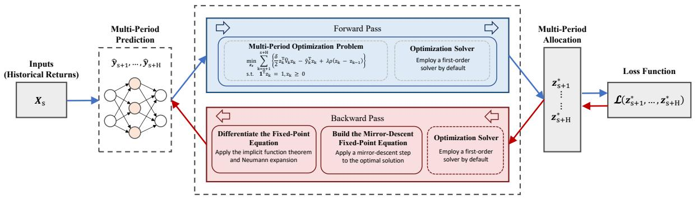  
Figure 1: Overview of IPMO. The predictor generates multi-period return predictions, which are passed to a differentiable optimization layer to produce the portfolio allocations. The fixed-point formulation enables implicit differentiation through the solver, allowing the entire multi-period decision process to be trained jointly.

allocation $\mathbf { z } _ { s } ^ { * } ( \theta )$ defines the forward decision output for date $s$ , which is evaluated by the downstream decision loss in (5). Consistent with the MPC approach, the network outputs an entire sequence of multiperiod portfolio weights, while only the first-step allocation is executed. All solver hyperparameters are kept unchanged between training and testing.

# 4.3.2 Backward pass

The backward pass propagates gradients from the evaluation loss back to the predictor parameters. The gradient of the empirical loss with respect to $\theta$ follows the chain rule:

$$
\nabla_ {\theta} \mathcal {L} _ {\mathrm {d}} (\theta) = \frac {1}{T} \sum_ {s = t - T - H + 1} ^ {t - H} \frac {\partial \ell_ {\mathrm {d}} \left(\mathbf {z} _ {s} ^ {*} (\theta) , Y\right)}{\partial \mathbf {z} _ {s} ^ {*} (\theta)} \frac {\partial \mathbf {z} _ {s} ^ {*} (\theta)}{\partial \theta}. \tag {11}
$$

The first partial derivative represents task-level sensitivity with respect to realized returns and risks. The second partial derivative differentiates through the inner allocation program, whose solution $\mathbf { z } _ { s } ^ { * } ( \theta )$ is defined by the MDFP layer (8) and its implicit gradient expression (9). The parameters are updated based on the average gradient of the training batch.

# 5 Experiments

To demonstrate the effectiveness of the IPMO framework and the proposed algorithm, we present computational results on real market data. Our analysis is divided into two parts. The first part compares outcomes of the IPMO model with the two-stage model under the MPC setting. We connect the portfolio behavior to the underlying models by analyzing the dynamics of portfolio weights and rolling predictions. The second part evaluates the efficiency of different end-to-end learning frameworks. We benchmark our differentiable optimization layer against the most commonly used methods in differentiable optimization.

# 5.1 Data and computational setup

We use daily asset returns for seven exchange-traded funds (ETFs) of major asset classes: VTI (Vanguard Total Stock Market ETF), IWM (iShares Russell 2000 ETF), AGG (iShares Core U.S. Aggregate Bond ETF), LQD (iShares iBoxx Investment Grade Corporate Bond ETF), MUB (iShares National Muni Bond ETF), DBC (Invesco DB Commodity Index Tracking Fund), and GLD (SPDR Gold Shares) over the time period 2011-2024, following Uysal et al. [38]. We keep the first eight years (2011-2018/12) for hyperparameter tuning and the remaining six years (2019-2024) for out-of-sample testing.

We consider two standard neural networks commonly used in multi-period time series forecasting and return prediction: the RLinear model [31] with L2 regularization and the CNN-LSTM model [34]. We experiment with both simple and sophisticated models to demonstrate the performance gains of endto-end learning under different model complexities. In the RLinear model, each asset return series is independently modeled by a single fully connected layer, and we average historical returns over five-day

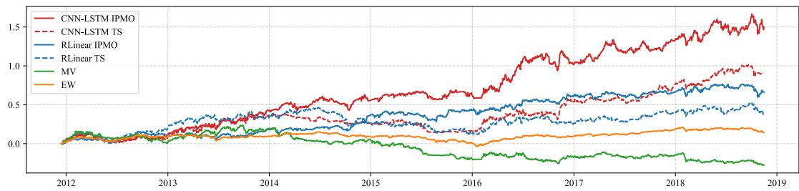

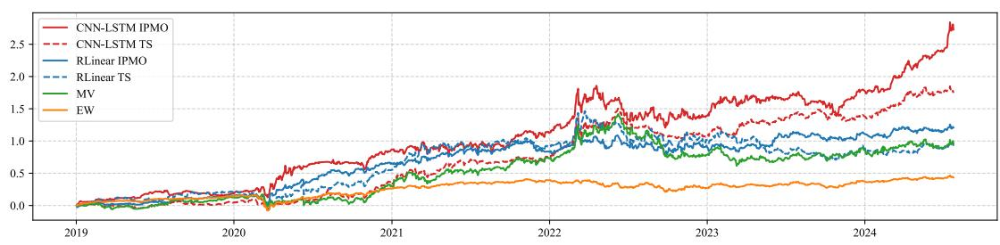  
Figure 2: Optimal portfolio cumulative returns net of transaction costs for six strategies over in-sample (top) and out-of-sample (bottom) periods.

intervals to mitigate estimation noise. The CNN-LSTM model applies a pooled model for all assets, as in Murray et al. [34]. The CNN-LSTM model uses a Convolutional Neural Network (CNN) with 64 channels, a kernel size of 5, stride of 1, and the ReLU activation. The CNN output is passed into a max-pooling layer with a kernel size of 2. The Long Short-Term Memory (LSTM) model has two layers with a hidden dimension of 64 and generates the final predictions. Both neural networks incorporate reversible instance normalization to address the distribution shift problem [22]. The predictive models are trained to predict the returns for the next $H$ days using the past 120-day historical returns and are re-trained every 20 days using a look-back window of 250 days. To keep the estimation process simple, the covariance estimation follows a simple EWMA method, updated daily using the historical returns of the past 20 days. The portfolio is rebalanced daily. On each day, the model generates portfolio weights over the prediction horizon, but only the allocation for the next period is applied, following Boyd et al. [10]. The hyperparameters include the learning rate $\gamma \in \{ 0 . 0 0 1 , 0 . 0 0 2 , 0 . 0 0 5 , 0 . 0 1 \}$ , the turnover penalty $\lambda \in \{ 0 . 0 0 0 1 , 0 . 0 0 0 5 , 0 . 0 0 1 , 0 . 0 0 5 , 0 . 0 1 \}$ , and the planning horizon $H \in \{ 1 , 5 , 1 0 , 2 0 , 5 0 \}$ . In addition, we tune the L2 regularizer for the linear model over the range $\{ 0 , 0 . 0 0 0 1 , 0 . 0 0 1 \}$ . For both the two-stage (TS) and IPMO frameworks, we select the hyperparameters based on the in-sample Sharpe ratio and turnover rate. Among the ten hyperparameters with the highest Sharpe ratios, we choose the one with the lowest turnover.

We benchmark our IPMO framework against standard portfolio allocation baselines, including an equal-weighted (EW) portfolio and a classical mean-variance (MV) portfolio. The EW portfolio uses constant $1 / N$ weights for all $N$ assets, rebalanced daily. The MV portfolio is constructed using the sample mean of the past 120-day returns and the same covariance estimators as above. Each predictive model is evaluated within the two-stage and the IPMO frameworks. We report results both before and after accounting for 20bps transaction costs. All experiments were conducted on a machine with an Intel $\mathbf { ( R ) }$ CoreTM Ultra 9 285H CPU and an NVIDIA GeForce RTX 5070 Laptop GPU (8 GB), using PyTorch 2.2 with CUDA 12.4.

# 5.2 Comparison of performance

Figure 2 shows cumulative returns net of transaction costs for in-sample and out-of-sample periods, and performance statistics are reported in Table 1. In both periods, the EW and MV benchmarks underperform the predictive models in terms of cumulative returns, and IPMO delivers consistently stronger risk-adjusted performance than the two-stage model for both predictors, gross and net of transaction costs.

In the in-sample period, with the stronger CNN-LSTM predictor, the IPMO model attains the best risk-adjusted performance, achieving the highest Sharpe ratio of 1.06, the highest Calmar ratio of 1.18, and the highest return to average drawdown ratio of 4.56 net of transaction costs. With the weaker

Table 1: Annualized portfolio performance statistics gross and net of transaction costs over in-sample (2011-2018) and out-of-sample (2019-2024) periods.   

<table><tr><td>Portfolio</td><td>Return</td><td>Volatility</td><td>Sharpe</td><td>MDD</td><td>Calmar</td><td>Return/ave.DD</td><td>Turnover</td></tr><tr><td colspan="8">2011-2018/12 Gross of transaction costs</td></tr><tr><td>CNN-LSTM IPMO</td><td>0.1451</td><td>0.1329</td><td>1.0922</td><td>0.1199</td><td>1.2100</td><td>4.6451</td><td>0.0850</td></tr><tr><td>CNN-LSTM TS</td><td>0.1047</td><td>0.1128</td><td>0.9279</td><td>0.1627</td><td>0.6436</td><td>2.4530</td><td>0.0967</td></tr><tr><td>RLinear IPMO</td><td>0.1021</td><td>0.0983</td><td>1.0383</td><td>0.0931</td><td>1.0964</td><td>5.9420</td><td>0.4719</td></tr><tr><td>RLinear TS</td><td>0.0898</td><td>0.1219</td><td>0.7362</td><td>0.2031</td><td>0.4420</td><td>1.7808</td><td>0.6923</td></tr><tr><td>EW</td><td>0.0217</td><td>0.0596</td><td>0.3640</td><td>0.1604</td><td>0.1353</td><td>0.5969</td><td>0.0028</td></tr><tr><td>MV</td><td>-0.0242</td><td>0.1246</td><td>-0.1940</td><td>0.3745</td><td>-0.0646</td><td>-0.1229</td><td>0.2513</td></tr><tr><td colspan="8">2011-2018/12 Net of transaction costs</td></tr><tr><td>CNN-LSTM IPMO</td><td>0.1411</td><td>0.1329</td><td>1.0623</td><td>0.1199</td><td>1.1767</td><td>4.5590</td><td>0.0850</td></tr><tr><td>CNN-LSTM TS</td><td>0.1000</td><td>0.1128</td><td>0.8860</td><td>0.1722</td><td>0.5806</td><td>2.1984</td><td>0.0967</td></tr><tr><td>RLinear IPMO</td><td>0.0783</td><td>0.0983</td><td>0.7965</td><td>0.0931</td><td>0.8412</td><td>4.5172</td><td>0.4719</td></tr><tr><td>RLinear TS</td><td>0.0550</td><td>0.1218</td><td>0.4516</td><td>0.2423</td><td>0.2271</td><td>0.7071</td><td>0.6922</td></tr><tr><td>EW</td><td>0.0215</td><td>0.0596</td><td>0.3603</td><td>0.1607</td><td>0.1336</td><td>0.5874</td><td>0.0028</td></tr><tr><td>MV</td><td>-0.0366</td><td>0.1246</td><td>-0.2938</td><td>0.4144</td><td>-0.0884</td><td>-0.1714</td><td>0.2513</td></tr><tr><td colspan="8">2019-2024/12 Gross of transaction costs</td></tr><tr><td>CNN-LSTM IPMO</td><td>0.2591</td><td>0.1921</td><td>1.3490</td><td>0.2271</td><td>1.1410</td><td>5.5592</td><td>0.0740</td></tr><tr><td>CNN-LSTM TS</td><td>0.1985</td><td>0.1566</td><td>1.2673</td><td>0.1881</td><td>1.0552</td><td>4.1896</td><td>0.0862</td></tr><tr><td>RLinear IPMO</td><td>0.1815</td><td>0.1463</td><td>1.2404</td><td>0.1668</td><td>1.0881</td><td>5.0095</td><td>0.5543</td></tr><tr><td>RLinear TS</td><td>0.1730</td><td>0.1919</td><td>0.9017</td><td>0.2660</td><td>0.6506</td><td>1.9801</td><td>0.7351</td></tr><tr><td>EW</td><td>0.0705</td><td>0.1008</td><td>0.6994</td><td>0.2073</td><td>0.3400</td><td>2.0793</td><td>0.0043</td></tr><tr><td>MV</td><td>0.1479</td><td>0.1898</td><td>0.7794</td><td>0.3318</td><td>0.4459</td><td>1.3533</td><td>0.1797</td></tr><tr><td colspan="8">2019-2024/12 Net of transaction costs</td></tr><tr><td>CNN-LSTM IPMO</td><td>0.2558</td><td>0.1920</td><td>1.3319</td><td>0.2271</td><td>1.1264</td><td>5.4880</td><td>0.0740</td></tr><tr><td>CNN-LSTM TS</td><td>0.1943</td><td>0.1566</td><td>1.2407</td><td>0.1893</td><td>1.0264</td><td>4.0020</td><td>0.0862</td></tr><tr><td>RLinear IPMO</td><td>0.1536</td><td>0.1463</td><td>1.0500</td><td>0.1668</td><td>0.9208</td><td>4.2395</td><td>0.5543</td></tr><tr><td>RLinear TS</td><td>0.1363</td><td>0.1919</td><td>0.7101</td><td>0.3105</td><td>0.4390</td><td>1.3159</td><td>0.7349</td></tr><tr><td>EW</td><td>0.0702</td><td>0.1008</td><td>0.6966</td><td>0.2073</td><td>0.3385</td><td>2.0612</td><td>0.0043</td></tr><tr><td>MV</td><td>0.1392</td><td>0.1898</td><td>0.7337</td><td>0.3324</td><td>0.4189</td><td>1.2442</td><td>0.1797</td></tr></table>

RLinear predictor, overall performance declines for both methods, but the advantage of the IPMO model persists. The RLinear IPMO model achieves a higher annualized return than the RLinear two-stage model ( $0 . 0 8 > 0 . 0 6$ ) and shows significantly better risk-adjusted performance in terms of the Sharpe ratio ( $0 . 8 0 > 0 . 4 5$ ) and the smallest maximum drawdown of 0.09. The differences between the IPMO and the two-stage model in terms of the Calmar ratio and the return to average drawdown ratio are evident (0.84 $> 0 . 2 3$ , $2 . 4 6 > 0 . 7 1$ ). The EW and MV benchmarks record the lowest Sharpe ratios, 0.36 and -0.29, respectively.

In the out-of-sample period, a similar pattern holds. The CNN-LSTM IPMO model dominates across all metrics except volatility, achieving the highest Sharpe ratio of 1.33, the highest Calmar ratio of 1.13, and the highest return to average drawdown ratio of 5.49 net of transaction costs. Under the weaker RLinear predictor, the IPMO model continues to outperform the two-stage model consistently across all performance measures. Notably, the RLinear two-stage model slightly underperforms the MV benchmark in Sharpe ratio $0 . 7 1 < 0 . 7 3$ ) net of transaction costs, indicating the limited effectiveness of two-stage training when predictive power is relatively weak.

Furthermore, the IPMO model trades less frequently than the two-stage model, exhibiting 2%-20% lower turnover rates, both in sample and out of sample. Consistently, the performance of the IPMO models deteriorates slightly less than the two-stage models net of transaction costs. During the in-sample period, the annualized returns decline by $0 . 4 0 \%$ and 0.47% for the IPMO and two-stage CNN-LSTM models, respectively. With the RLinear predictor, the reductions are much more significant, 2.38% for the IPMO model and $3 . 4 8 \%$ for the two-stage model. During the out-of-sample period, the annualized returns decrease by $0 . 3 3 \%$ for the CNN-LSTM IPMO model and 0.42% for the CNN-LSTM two-stage model. For RLinear models, the drops are 2.79% and 3.67%. Overall, the IPMO models maintain their performance better than the two-stage models in terms of risk-adjusted returns and drawdowns via more cost-efficient portfolio adjustments. Although the performance statistics are primarily determined by the prediction model, the IPMO framework delivers robust and consistent improvements over the two-stage method in the multi-period setting.

Next, we visualize the portfolio weights over time using a heatmap in Figure 3. For RLinear, the two-stage model tends to hold large positions across several assets and frequently makes abrupt shifts in the set of holdings. Instead, the RLinear IPMO model exhibits smoother trajectories, where weight

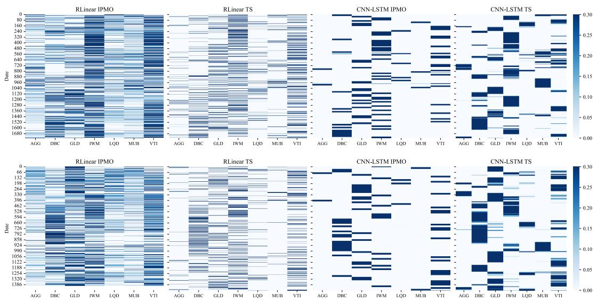  
Figure 3: Optimal portfolio weights across seven ETFs for four strategies over in-sample (top) and outof-sample (bottom) periods.

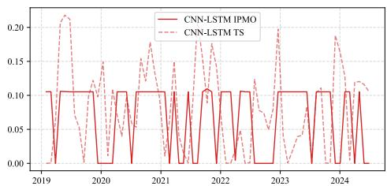

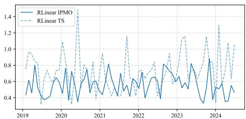  
Figure 4: Average total variation of out-of-sample portfolio weights for four strategies over nonoverlapping 20-day windows.

Table 2: Sharpe ratios across different prediction horizons.   

<table><tr><td>H</td><td>RLinear IPMO</td><td>RLinear TS</td><td>CNN-LSTM IPMO</td><td>CNN-LSTM TS</td></tr><tr><td>1</td><td>0.5231</td><td>0.4165</td><td>0.7555</td><td>0.6690</td></tr><tr><td>5</td><td>0.8156</td><td>0.7101</td><td>1.0891</td><td>0.7145</td></tr><tr><td>10</td><td>0.7278</td><td>0.6441</td><td>1.1624</td><td>1.0392</td></tr><tr><td>20</td><td>0.8577</td><td>0.6974</td><td>1.1679</td><td>1.0818</td></tr><tr><td>50</td><td>1.0500</td><td>0.7738</td><td>1.3319</td><td>1.2407</td></tr></table>

Table 3: Mean squared forecast error across different prediction horizons.   

<table><tr><td>H</td><td>RLinear IPMO</td><td>RLinear TS</td><td>CNN-LSTM IPMO</td><td>CNN-LSTM TS</td></tr><tr><td>1</td><td>1.13 × 10-4</td><td>1.10 × 10-4</td><td>1.62 × 10-4</td><td>1.06 × 10-4</td></tr><tr><td>5</td><td>1.14 × 10-4</td><td>1.09 × 10-4</td><td>2.35 × 10-4</td><td>1.07 × 10-4</td></tr><tr><td>10</td><td>1.16 × 10-4</td><td>1.09 × 10-4</td><td>2.72 × 10-4</td><td>1.07 × 10-4</td></tr><tr><td>20</td><td>1.14 × 10-4</td><td>1.11 × 10-4</td><td>2.93 × 10-4</td><td>1.06 × 10-4</td></tr><tr><td>50</td><td>1.18 × 10-4</td><td>1.09 × 10-4</td><td>3.23 × 10-4</td><td>1.08 × 10-4</td></tr></table>

adjustments occur in smaller increments and remain stable over longer intervals. For CNN-LSTM, both models maintain highly concentrated positions, holding a single asset for extended periods. Nonetheless, the two-stage model still exhibits instantaneous reallocations occasionally, while the IPMO model shows a buy-and-hold behavior and the reallocation frequency is more consistent.

Figure 4 reports the rolling 20-day total variation (TV) of portfolio weights. The difference in allocation behavior observed in Figure 3 is clearly reflected in their TV dynamics. For RLinear, the two-stage model exhibits both higher peak values and stronger fluctuations, implying large and frequent reallocations among assets. In contrast, the IPMO model keeps TV within a consistently lower and narrower range, indicating smoother transitions and gradual, small-magnitude adjustments over time. For CNN-LSTM, both models achieve much lower overall TV levels, consistent with their concentrated and long-holding allocation patterns. Yet, the two-stage model still displays occasional surges in TV, suggesting abrupt switches, while the IPMO model’s TV remains organized around two discrete levels, approximately 0 and 0.105, corresponding to long stationary phases punctuated by short, well-defined rebalancing events. This discrete switching pattern signifies a highly organized low-frequency turnover regime. Overall, these results confirm that the IPMO model delivers more temporally stable and coherent allocation patterns across both predictor types.

To evaluate whether the performance advantage of the IPMO model persists across different planning horizons and whether this advantage stems from improved accuracy of return predictions, we report outof-sample Sharpe ratios and mean squared forecast error (MSE) for each $H$ in Table 2 and Table 3, and visualize their joint behavior in Figure 5. Across all configurations, the IPMO model consistently attains higher Sharpe ratios than the two-stage benchmark. For both the IPMO model and the twostage model, Sharpe ratios generally improve with longer horizons and reach their highest values when $H { = } 5 0$ . It is worth noting that when $H { = } 1$ , corresponding to a single-period formulation, all methods deliver their lowest Sharpe ratio. This degradation reflects the two limitations discussed earlier: the inability of a single-stage objective to internalize the intertemporal impact of transaction costs and the absence of multi-period coupling, which leads to inconsistent forecasts and conflicting signals. Examining model-specific patterns, the RLinear predictor displays a modest dip in Sharpe ratio around $H { = } 1 0$ , after which the gap shifts decisively in favor of the IPMO model. For the higher-capacity CNN-LSTM predictor, performance improves almost monotonically with $H$ , and the IPMO model maintains a clear lead throughout. The persistence of this gap across predictors indicates that the advantage of IPMO is robust.

The MSE results further clarify the source of these gains in Sharpe ratio. Under RLinear, the IPMO model attains slightly higher MSE than the two-stage model across all horizons, yet consistently achieves superior Sharpe ratios. This pattern indicates that the IPMO model sacrifices a small amount of pointwise predictive accuracy in exchange for reduced decision error, producing forecasts that align more closely with the multi-period, transaction-cost-aware objective. For CNN-LSTM, the two-stage model shows the lowest and almost horizon-invariant MSE, suggesting that it has reached the accuracy limit achievable by the underlying architecture, which directly contributes to its performance improvement. In contrast, the IPMO model produces the largest MSE, and this discrepancy grows systematically with $H$ . This reflects that, with a higher-capacity prediction model such as CNN-LSTM, a larger planning window enables the end-to-end objective to induce forecast adjustments that depart more substantially from pointwise

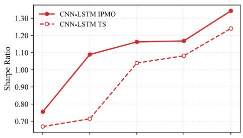

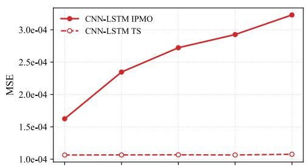

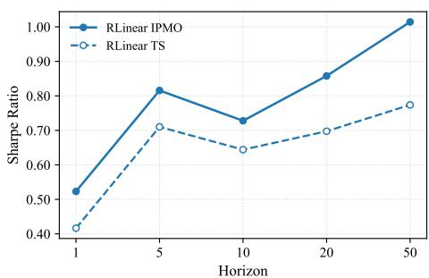

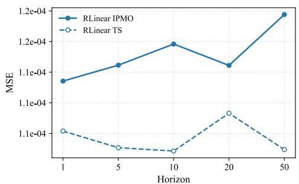  
Figure 5: Sharpe ratios (left) and MSE (right) across forecasting horizons for CNN-LSTM (top) and RLinear (bottom) models.

Table 4: Runtime comparison across horizons based on 200 epochs, with lower values indicating better performance.   

<table><tr><td rowspan="2">Method</td><td colspan="10">Horizon</td></tr><tr><td>10</td><td>20</td><td>30</td><td>40</td><td>50</td><td>60</td><td>70</td><td>80</td><td>90</td><td>100</td></tr><tr><td>MDFP</td><td>3.57</td><td>3.63</td><td>3.67</td><td>3.74</td><td>3.81</td><td>3.88</td><td>3.93</td><td>3.94</td><td>4.15</td><td>4.26</td></tr><tr><td>BPQP</td><td>1.54</td><td>2.73</td><td>3.66</td><td>5.03</td><td>6.63</td><td>7.74</td><td>9.11</td><td>10.78</td><td>12.30</td><td>14.01</td></tr><tr><td>CvxpyLayer</td><td>4.01</td><td>7.65</td><td>11.27</td><td>21.69</td><td>23.49</td><td>26.24</td><td>36.32</td><td>48.41</td><td>64.29</td><td>93.00</td></tr></table>

accuracy in order to encode richer intertemporal structure relevant for the multi-period decision problem. Despite these larger deviations, the IPMO model still attains the best post-fee performance, indicating that the resulting biases are decision-useful and shape the forecast path in a way that more effectively supports multi-period allocation.

# 5.3 Comparison of scalability

To evaluate computational efficiency, we compare the proposed MDFP layer with two state-of-the-art differentiable convex optimizers: BPQP and CvxpyLayer. All models are trained end-to-end under the same experimental pipeline using the RLinear predictor. We report the average time per training epoch. We also ran CNN-LSTM and observed qualitatively similar scaling, but omit it here for brevity. The problem size is controlled by the prediction horizon $H$ : increasing $H$ expands the optimization dimension, as every additional 10-step horizon introduces 70 new decision variables into the underlying arg min problem. For gradient computation, the MDFP layer adopts a Neumann-series approximation of the implicit Jacobian inverse, with the residual norm capped at $1 0 ^ { - 6 }$ to ensure stable and accurate differentiation while maintaining low computational overhead.

The results are summarized in Table 4 and visualized in Figure 6. Among all methods, MDFP is the most size-insensitive: its runtime increases by only about 0.69 s from the smallest to the largest horizon, remaining nearly constant across the range. By contrast, BPQP scales almost linearly with the increasing horizon, which is competitive at small instances but quickly overtaken as $H$ grows, whereas CvxpyLayer exhibits the steepest growth. Accordingly, MDFP’s advantage widens with scale. It is worth noting that at the largest horizon, MDFP is about 3.29 $\times$ faster than BPQP and 21.83 $\times$ faster than CvxpyLayer. These findings further corroborate our theoretical rationale. CvxpyLayer’s reliance on large KKT factorizations and conic reformulations leads to poor scaling. BPQP still incurs horizon-coupled linear-system solves whose iteration burden grows with size. Whereas our lightweight MDFP layer with a Neumann-series approximation avoids explicit matrix inversion and heavy factorization, yielding stable

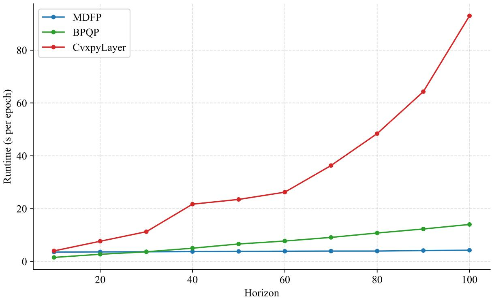  
Figure 6: Table 4 visualization.

and efficient differentiation at scale.

# 6 Conclusion

In this work, we propose IPMO for multi-period portfolio optimization, integrating prediction and decision-making within a single differentiable model. By aligning return forecasts with portfolio objectives under transaction costs, the model learns economically consistent signals rather than optimizing a purely statistical loss. Empirical results on real ETF data demonstrate that the IPMO models consistently outperform their two-stage counterparts across different prediction models and planning horizons. With the RLinear model, IPMO regularizes portfolio dynamics, yielding steadier adjustments and lower transaction intensity. With the CNN-LSTM model, it captures meaningful shifts in portfolio composition, enabling timely responses to changing regimes without excessive turnover. Across both settings, the IPMO framework produces coherent allocation trajectories, leading to higher post-fee Sharpe ratios and improved drawdown control. Algorithmically, the proposed MDFP layer enables efficient and scalable training without explicit KKT factorizations, maintaining near-constant runtime as the horizon grows. This makes IPMO readily applicable to realistic multi-period decision environments.

However, there are still some limitations to this study. The current MDFP formulation is developed under simplex constraints, where the mirror-descent geometry ensures a well-defined fixed point. Nevertheless, the underlying idea is more general: any optimization problem whose solution satisfies a stable fixed-point relation can, in principle, be embedded within the same IPMO differentiation paradigm. Future work may formalize this generalization and extend it to richer constraint structures. In addition, the empirical analysis focuses on a moderate-sized asset universe to facilitate interpretable comparisons of portfolio dynamics. Scaling the framework to larger universes would provide a more rigorous test of its robustness and offer insight into how the learned temporal structure evolves in high-dimensional decision spaces. Advancing these directions would further consolidate IPMO optimization as a general methodology for multi-period financial decision-making.

# A Proof of Theorem 1

Proof. Recall that $\mathbf { z } _ { t } ^ { * } = ( z _ { t + 1 } ^ { * } , \ldots , z _ { t + H } ^ { * } )$ is the optimal solution of $\mathrm { m i n } _ { { \mathbf z } _ { t } \in \Omega } f ( { \mathbf z } _ { t } , \theta )$ . The KKT conditions yield, for each stage $s = t + 1 , \ldots , t + H$ , the existence of multipliers $\mu _ { s } \in \mathbb { R }$ and $\boldsymbol { \nu } _ { s } \in \mathbb { R } _ { \ge 0 } ^ { N }$ such that

$$
\nabla_ {z _ {s}} f (\mathbf {z} _ {t} ^ {*}, \theta) + \mu_ {s} \mathbf {1} - \nu_ {s} = 0,
$$

$$
\nu_ {s, i} \geq 0, \quad i = 1, \dots , N,
$$

$$
\nu_ {s, i} z _ {s, i} ^ {*} = 0, \quad i = 1, \ldots , N,
$$

$$
\mathbf {1} ^ {\top} z _ {s} ^ {*} = 1, \quad z _ {s} ^ {*} \geq 0.
$$

Let $B _ { s } = \{ i : z _ { s , i } ^ { * } > 0 \}$ be the active index set at stage $s$ . By complementary slackness, $\nu _ { s , i } = 0$ for $i \in \boldsymbol { B } _ { s }$ , hence

$$
\nabla_ {z _ {s, i}} f \left(\mathbf {z} _ {t} ^ {*}, \theta\right) = - \mu_ {s}, \quad i \in \mathcal {B} _ {s},
$$

while $z _ { s , i } ^ { * } = 0$ and $\nu _ { s , i } \geq 0$ for $i \notin B _ { s }$

Consider the stagewise Mirror Descent (MD) map:

$$
\Phi_ {s, i} (\mathbf {z} _ {t}, \theta) = \frac {z _ {s , i} \exp \big (- \eta \nabla_ {z _ {s , i}} f (\mathbf {z} _ {t} , \theta) \big)}{\sum_ {j = 1} ^ {N} z _ {s , j} \exp \big (- \eta \nabla_ {z _ {s , j}} f (\mathbf {z} _ {t} , \theta) \big)}, \qquad \eta > 0,
$$

and $\Phi ( \mathbf { z } _ { t } , \theta ) = ( \Phi _ { t + 1 } ( \mathbf { z } _ { t } , \theta ) , \ldots , \Phi _ { t + H } ( \mathbf { z } _ { t } , \theta ) )$ . Evaluating at $\mathbf { z } _ { t } ^ { \ast }$ and distinguishing between $i \in \mathcal { B } _ { s }$ and $i \notin B _ { s }$ :

$$
\text {n u m e r a t o r} = \left\{ \begin{array}{l l} z _ {s, i} ^ {*} \exp (\eta \mu_ {s}), & i \in \mathcal {B} _ {s} \\ 0, & i \notin \mathcal {B} _ {s} \end{array} \right.,
$$

$$
\text {d e n o m i n a t o r} = \sum_ {j \in \mathcal {B} _ {s}} z _ {s, j} ^ {*} \exp (\eta \mu_ {s}) = \exp (\eta \mu_ {s}) \sum_ {j \in \mathcal {B} _ {s}} z _ {s, j} ^ {*} = \exp (\eta \mu_ {s}).
$$

Therefore, for all $i$ ,

$$
\Phi_ {s, i} (\mathbf {z} _ {t} ^ {*}, \theta) = \left\{ \begin{array}{l l} z _ {s, i} ^ {*} \exp (\eta \mu_ {s}) / \exp (\eta \mu_ {s}) = z _ {s, i} ^ {*}, & i \in \mathcal {B} _ {s} \\ 0, & i \notin \mathcal {B} _ {s} \end{array} \right.,
$$

so $\Phi _ { s } ( \mathbf { z } _ { t } ^ { * } , \theta ) = z _ { s } ^ { * }$ for each $s$ , and hence $\Phi ( \mathbf { z } _ { t } ^ { * } , \theta ) = \mathbf { z } _ { t } ^ { * }$

# B Proof of Proposition 1

Proof. Starting from the fixed-point relation $\mathbf { z } _ { t } ^ { * } = \Phi ( \mathbf { z } _ { t } ^ { * } , \theta )$ , take the total derivative with respect to $\theta$ :

$$
\frac {\partial \mathbf {z} _ {t} ^ {*}}{\partial \theta} = \partial_ {\mathbf {z} _ {t} ^ {*}} \Phi (\mathbf {z} _ {t} ^ {*}, \theta) \frac {\partial \mathbf {z} _ {t} ^ {*}}{\partial \theta} + \frac {\partial \Phi (\mathbf {z} _ {t} ^ {*} , \theta)}{\partial \theta}.
$$

Rearranging terms yields

$$
\left(I - \partial_ {\mathbf {z} _ {t} ^ {*}} \Phi (\mathbf {z} _ {t} ^ {*}, \theta)\right) \frac {\partial \mathbf {z} _ {t} ^ {*}}{\partial \theta} = \frac {\partial \Phi (\mathbf {z} _ {t} ^ {*} , \theta)}{\partial \theta}.
$$

Then, we obtain

$$
\frac {\partial \mathbf {z} _ {t} ^ {*}}{\partial \theta} = \left(I - \partial_ {\mathbf {z} _ {t} ^ {*}} \Phi (\mathbf {z} _ {t} ^ {*}, \theta)\right) ^ {- 1} \frac {\partial \Phi (\mathbf {z} _ {t} ^ {*} , \theta)}{\partial \theta},
$$

which is exactly (9).

# C Proof of Theorem 2

Proof. First, we decompose the Jacobian ${ \partial { \bf z } _ { t } ^ { * } } / { \partial \theta }$ in (9). The mirror-descent fixed-point equation acts stagewise on $\mathbf { z } _ { t } = ( z _ { t + 1 } , \dots , z _ { t + H } )$ . In particular, we collect $\Phi ( \mathbf { z } _ { t } , \theta ) = \left( \Phi _ { t + 1 } , \ldots , \Phi _ { t + H } \right)$ , where each component $\Phi _ { s }$ depends only on the corresponding Jacobian of the simplex variable ${ z } _ { s }$ and the parameter $\theta$ . Hence, the Jacobian $\partial _ { \mathbf { z } _ { t } } \Phi ( \mathbf { z } _ { t } , \theta )$ is block-diagonal with respect to the decomposition $\mathbf z _ { t } = ( z _ { t + 1 } , \dots , z _ { t + H } )$ . Consequently, the fixed-point Jacobian

$$
\frac {\partial \mathbf {z} _ {t} ^ {*}}{\partial \theta} = \left(I - \partial_ {\mathbf {z} _ {t} ^ {*}} \Phi (\mathbf {z} _ {t} ^ {*}, \theta)\right) ^ {- 1} \frac {\partial \Phi (\mathbf {z} _ {t} ^ {*} , \theta)}{\partial \theta}
$$

decomposes componentwise across stages, so it is enough to establish the equivalence with the KKT-based sensitivity for a single simplex. The proof proceeds in two stages. First, we establish the equivalence between fixed-point-based and KKT-based sensitivities at an interior fixed point $\mathbf { z } _ { t } ^ { \ast }$ . We then extend the argument to general cases in which $\mathbf { z } _ { t } ^ { \ast }$ resides on the boundary.

We fixate the stage $s \in \{ t + 1 , \ldots , t + H \}$ . The multiplicative mirror-descent update is

$$
\Phi_ {s, i} (z _ {s}, \theta) = \frac {z _ {s , i} \exp \left(- \eta [ \nabla_ {z _ {s}} \tilde {F} (\mathbf {z} _ {t} , \tilde {Y} _ {s}) ] _ {i}\right)}{\sum_ {j = 1} ^ {N} z _ {s , j} \exp \left(- \eta [ \nabla_ {z _ {s}} \tilde {F} (\mathbf {z} _ {t} , \tilde {Y} _ {s}) ] _ {j}\right)}, i = 1, \ldots , N,
$$

where $\tilde { F }$ is defined in (4). For the ease in descriptions, we introduce the following shorthand notations:

$$
b \left(z _ {s}, \theta\right) := \nabla_ {z _ {s}} \tilde {F} \left(\mathbf {z} _ {t}, \hat {Y} _ {s}\right),
$$

$$
Q (z _ {s}, \theta) := \nabla_ {z _ {s} z _ {s}} ^ {2} \tilde {F} (\mathbf {z} _ {t}, \tilde {Y} _ {s}),
$$

$$
a _ {i} \left(z _ {s}, \theta\right) := - \eta b _ {i} \left(z _ {s}, \theta\right), \quad i = 1, \dots , N,
$$

$$
D \left(z _ {s}, \theta\right) := \operatorname {d i a g} \left(e ^ {a _ {1} \left(z _ {s}, \theta\right)}, \dots , e ^ {a _ {N} \left(z _ {s}, \theta\right)}\right),
$$

$$
r _ {i} \left(z _ {s}, \theta\right) := z _ {s, i} e ^ {a _ {i} \left(z _ {s}, \theta\right)}, \quad i = 1, \dots , N,
$$

$$
M (z _ {s}, \theta) := \sum_ {j = 1} ^ {N} r _ {j} (z _ {s}, \theta).
$$

Then we can write

$$
\Phi_ {s, i} \left(z _ {s}, \theta\right) = \frac {r _ {i} \left(z _ {s} , \theta\right)}{M \left(z _ {s} , \theta\right)}, \quad i = 1, \dots , N. \tag {12}
$$

To begin with, we derive the Jacobian $\partial _ { z _ { s } } \Phi _ { s } ( z _ { s } , \theta )$ at a general interior point. For $j = 1 , \dots , N$ , the partial derivative of $a _ { i }$ with respect to $z _ { s , j }$ is $\begin{array} { r } { \frac { \partial a _ { i } ( z _ { s } , \theta ) } { \partial z _ { s , j } } = - \eta Q _ { i j } ( z _ { s } , \theta ) } \end{array}$ ∂zs,j , so by the product rule,

$$
\begin{array}{l} \frac {\partial r _ {i} (z _ {s} , \theta)}{\partial z _ {s , j}} = \frac {\partial}{\partial z _ {s , j}} \left(z _ {s, i} e ^ {a _ {i} (z _ {s}, \theta)}\right) \\ = e ^ {a _ {i} \left(z _ {s}, \theta\right)} \mathbf {1} _ {\{i = j \}} + z _ {s, i} e ^ {a _ {i} \left(z _ {s}, \theta\right)} \frac {\partial a _ {i} \left(z _ {s} , \theta\right)}{\partial z _ {s , j}} \tag {13} \\ = e ^ {a _ {i} (z _ {s}, \theta)} {\bf 1} _ {\{i = j \}} - \eta z _ {s, i} e ^ {a _ {i} (z _ {s}, \theta)} Q _ {i j} (z _ {s}, \theta). \\ \end{array}
$$

where $\mathbf { 1 } _ { \{ i = j \} }$ denotes the indicator function. Let $\boldsymbol { r } ( z _ { s } , \theta ) = \big ( r _ { 1 } ( z _ { s } , \theta ) , \dots , r _ { N } ( z _ { s } , \theta ) \big ) ^ { \intercal }$ , so that $\Phi _ { s } ( z _ { s } , \theta ) =$ $\frac { 1 } { M ( z _ { s } , \theta ) } r ( z _ { s } , \theta )$ and $M ( z _ { s } , \theta ) = \mathbf { 1 } ^ { \prime } r ( z _ { s } , \theta )$ . By (13), the Jacobian of $r ( z _ { s } , \theta )$ with respect to $z _ { s }$ is

$$
\partial_ {z _ {s}} r (z _ {s}, \theta) = D (z _ {s}, \theta) - \eta \operatorname {d i a g} (z _ {s}) D (z _ {s}, \theta) Q (z _ {s}, \theta). \tag {14}
$$

Since $M ( z _ { s } , \theta ) = \mathbf { 1 } ^ { \top } r ( z _ { s } , \theta )$ , the gradient of $M$ is $\partial _ { z _ { s } } M ( z _ { s } , \theta ) = \big ( \partial _ { z _ { s } } r ( z _ { s } , \theta ) \big ) ^ { \top } { \bf 1 }$ . For (12), by the quotient rule,

$$
\partial_ {z _ {s}} \Phi_ {s} (z _ {s}, \theta) = \frac {1}{M (z _ {s} , \theta)} \partial_ {z _ {s}} r (z _ {s}, \theta) - \frac {1}{M (z _ {s} , \theta) ^ {2}} r (z _ {s}, \theta) \big (\partial_ {z _ {s}} M (z _ {s}, \theta) \big) ^ {\top}.
$$

Using $r ( z _ { s } , \theta ) = M ( z _ { s } , \theta ) \Phi _ { s } ( z _ { s } , \theta )$ and $\partial _ { z _ { s } } M ( z _ { s } , \theta ) = \big ( \partial _ { z _ { s } } r ( z _ { s } , \theta ) \big ) ^ { \top } { \bf 1 }$ , we obtain

$$
\partial_ {z _ {s}} \Phi_ {s} (z _ {s}, \theta) = \frac {1}{M (z _ {s} , \theta)} \Bigl (I - \Phi_ {s} (z _ {s}, \theta) {\bf 1} ^ {\top} \Bigr) \partial_ {z _ {s}} r (z _ {s}, \theta).
$$

Substituting $\partial _ { z _ { s } } r ( z _ { s } , \theta )$ with (14), we finally obtain

$$
\begin{array}{l} \partial_ {z _ {s}} \Phi_ {s} \left(z _ {s}, \theta\right) = \frac {1}{M \left(z _ {s} , \theta\right)} \left(I - \Phi_ {s} \left(z _ {s}, \theta\right) \mathbf {1} ^ {\top}\right) \tag {15} \\ \Big (D (z _ {s}, \theta) - \eta \operatorname {d i a g} (z _ {s}) D (z _ {s}, \theta) Q (z _ {s}, \theta) \Big). \\ \end{array}
$$

Next, we can now compute the Jacobian at an interior fixed point. Let $P _ { s } \triangleq I - z _ { s } ^ { \ast } \mathbf { 1 } ^ { \intercal }$ . By the KKT condition at an interior optimal solution $z _ { s } ^ { * }$ , we have $b _ { i } ( z _ { s } ^ { * } , \theta ) = \mu _ { s } , i = 1 , \dots , N$ . Then

$$
D \left(z _ {s} ^ {*}, \theta\right) = e ^ {- \eta \mu_ {s}} I =: \alpha_ {s} I, \tag {16a}
$$

$$
M \left(z _ {s} ^ {*}, \theta\right) = \sum_ {i = 1} ^ {N} z _ {s, i} ^ {*} e ^ {a _ {i} \left(z _ {s} ^ {*}, \theta\right)} = \alpha_ {s} \sum_ {i = 1} ^ {N} z _ {s, i} ^ {*} = \alpha_ {s}. \tag {16b}
$$

Plugging (16a) and (16b) into (15), we obtain

$$
\begin{array}{l} \partial_ {z _ {s}} \Phi_ {s} (z _ {s} ^ {*}, \theta) = \frac {1}{\alpha_ {s}} P _ {s} \left(\alpha_ {s} I - \eta \alpha_ {s} \operatorname {d i a g} (z _ {s} ^ {*}) Q (z _ {s} ^ {*}, \theta)\right) \\ = P _ {s} \left(I - \eta \operatorname {d i a g} \left(z _ {s} ^ {*}\right) Q \left(z _ {s} ^ {*}, \theta\right)\right), \tag {17} \\ \end{array}
$$

Next, we compute the partial derivative $\partial _ { \theta } \Phi _ { s } ( z _ { s } ^ { * } , \theta )$ . Let $K ( z _ { s } , \theta ) = \partial _ { \theta } b ( z _ { s } , \theta )$ . Then $\partial _ { \theta } a ( z _ { s } , \theta ) =$ $- \eta K ( z _ { s } , \theta )$ . For each $i = 1 , \ldots , N$ , the derivative of $r _ { i } ( z _ { s } , \theta ) = z _ { s , i } e ^ { a _ { i } ( z _ { s } , \theta ) }$ with respect to $\theta$ is

$$
\partial_ {\theta} r _ {i} \left(z _ {s}, \theta\right) = z _ {s, i} e ^ {a _ {i} \left(z _ {s}, \theta\right)} \partial_ {\theta} a _ {i} \left(z _ {s}, \theta\right),
$$

In vector form,

$$
\begin{array}{l} \partial_ {\theta} r \left(z _ {s}, \theta\right) = \operatorname {d i a g} \left(z _ {s}\right) D \left(z _ {s}, \theta\right) \partial_ {\theta} a \left(z _ {s}, \theta\right) \tag {18} \\ = - \eta \operatorname {d i a g} \left(z _ {s}\right) D \left(z _ {s}, \theta\right) K \left(z _ {s}, \theta\right). \\ \end{array}
$$

Since $M ( z _ { s } , \theta ) = \mathbf { 1 } ^ { \top } r ( z _ { s } , \theta )$ , we have $\partial _ { \theta } M ( z _ { s } , \theta ) = \mathbf { 1 } ^ { \top } \partial _ { \theta } r ( z _ { s } , \theta )$ . For (12), by the quotient rule,

$$
\begin{array}{l} \partial_ {\theta} \Phi_ {s} (z _ {s}, \theta) = \frac {1}{M (z _ {s} , \theta)} \partial_ {\theta} r (z _ {s}, \theta) - \frac {1}{M (z _ {s} , \theta) ^ {2}} r (z _ {s}, \theta) \left(\partial_ {\theta} M (z _ {s}, \theta)\right) \\ = \frac {1}{M \left(z _ {s} , \theta\right)} \left(I - \Phi_ {s} \left(z _ {s}, \theta\right) \mathbf {1} ^ {\top}\right) \partial_ {\theta} r \left(z _ {s}, \theta\right). \tag {19} \\ \end{array}
$$

Finally, because $r ( z _ { s } , \theta ) = M ( z _ { s } , \theta ) \Phi _ { s } ( z _ { s } , \theta )$ , we obtain

$$
\begin{array}{l} \operatorname {d i a g} \left(z _ {s}\right) D \left(z _ {s}, \theta\right) = \operatorname {d i a g} \left(r \left(z _ {s}, \theta\right)\right) \tag {20} \\ = M \left(z _ {s}, \theta\right) \operatorname {d i a g} \left(\Phi_ {s} \left(z _ {s}, \theta\right)\right). \\ \end{array}
$$

Plugging (18) and (20) into (19), we obtain

$$
\partial_ {\theta} \Phi_ {s} \left(z _ {s}, \theta\right) = - \eta \left(I - \Phi_ {s} \left(z _ {s}, \theta\right) \mathbf {1} ^ {\top}\right) \operatorname {d i a g} \left(\Phi_ {s} \left(z _ {s}, \theta\right)\right) K \left(z _ {s}, \theta\right). \tag {21}
$$

Evaluating (21) at the interior fixed point $\Phi _ { s } ( z _ { s } ^ { * } , \theta ) = z _ { s } ^ { * }$ yields

$$
\partial_ {\theta} \Phi_ {s} \left(z _ {s} ^ {*}, \theta\right) = - \eta \left(I - z _ {s} ^ {*} \mathbf {1} ^ {\top}\right) \operatorname {d i a g} \left(z _ {s} ^ {*}\right) K \left(z _ {s} ^ {*}, \theta\right). \tag {22}
$$

Equivalence between fixed-point-based and KKT-based sensitivities at an interior fixed point Differentiating the fixed-point relation $z _ { s } ^ { * } = \Phi _ { s } ( z _ { s } ^ { * } , \theta )$ with respect to $\theta$ , we obtain

$$
\left(I - \partial_ {z _ {s}} \Phi_ {s} \left(z _ {s} ^ {*}, \theta\right)\right) \frac {\partial z _ {s} ^ {*}}{\partial \theta} = \partial_ {\theta} \Phi_ {s} \left(z _ {s} ^ {*}, \theta\right). \tag {23}
$$

Plugging (17) and (22) into (23), this becomes

$$
\begin{array}{l} \left(I - P _ {s} \left(I - \eta \operatorname {d i a g} \left(z _ {s} ^ {*}\right) Q \left(z _ {s} ^ {*}, \theta\right)\right)\right) \frac {\partial z _ {s} ^ {*}}{\partial \theta} \tag {24} \\ = - \eta P _ {s} \operatorname {d i a g} \left(z _ {s} ^ {*}\right) K \left(z _ {s} ^ {*}, \theta\right). \\ \end{array}
$$

Rearranging (24), we have

$$
\begin{array}{l} \left(z _ {s} ^ {*} \mathbf {1} ^ {\top} + \eta P _ {s} \operatorname {d i a g} \left(z _ {s} ^ {*}\right) Q \left(z _ {s} ^ {*}, \theta\right)\right) \frac {\partial z _ {s} ^ {*}}{\partial \theta} \tag {25} \\ = - \eta P _ {s} \operatorname {d i a g} \left(z _ {s} ^ {*}\right) K \left(z _ {s} ^ {*}, \theta\right). \\ \end{array}
$$

Note that since $z _ { s } ^ { * }$ lies in the simplex, we have $\mathbf { 1 } ^ { \top } z _ { s } ^ { * } = 1$ , hence $\begin{array} { r } { \mathbf { 1 } ^ { \top } \frac { \partial z _ { s } ^ { * } } { \partial \theta } = 0 } \end{array}$ . Plugging this result into (25) and cancelling the common factor $\eta > 0$ , we are left with

$$
P _ {s} \operatorname {d i a g} \left(z _ {s} ^ {*}\right) \left(Q \left(z _ {s} ^ {*}, \theta\right) \frac {\partial z _ {s} ^ {*}}{\partial \theta} + K \left(z _ {s} ^ {*}, \theta\right)\right) = 0. \tag {26}
$$

Thus the vector $\begin{array} { r } { \mathrm { d i a g } ( z _ { s } ^ { * } ) \Big ( Q ( z _ { s } ^ { * } , \theta ) \frac { \partial z _ { s } ^ { * } } { \partial \theta } + K ( z _ { s } ^ { * } , \theta ) \Big ) } \end{array}$ belongs to the kernel of $P _ { s }$ , which equals span $\{ z _ { s } ^ { * } \}$ since $\mathbf { 1 } ^ { \top } z _ { s } ^ { * } = 1$ . Hence, there exists a vector $\xi _ { s }$ such that

$$
\operatorname {d i a g} \left(z _ {s} ^ {*}\right) \left(Q \left(z _ {s} ^ {*}, \theta\right) \frac {\partial z _ {s} ^ {*}}{\partial \theta} + K \left(z _ {s} ^ {*}, \theta\right)\right) = z _ {s} ^ {*} \xi_ {s} ^ {\mathrm {T}}. \tag {27}
$$

Since $z _ { s , i } ^ { * } > 0$ for all $i$ in the interior case, $\mathrm { d i a g } ( z _ { s } ^ { * } )$ is invertible, and (27) is equivalent to

$$
Q \left(z _ {s} ^ {*}, \theta\right) \frac {\partial z _ {s} ^ {*}}{\partial \theta} + K \left(z _ {s} ^ {*}, \theta\right) = \mathbf {1} \xi_ {s} ^ {\top}, \quad \mathbf {1} ^ {\top} \frac {\partial z _ {s} ^ {*}}{\partial \theta} = 0. \tag {28}
$$

Equation (28) precisely corresponds to the system of linear equations derived by differentiating the KKT conditions for the subproblem at stage $s$ .

Equivalence at boundary points under strict complementarity Let $B _ { s } : = \{ i : z _ { s , i } ^ { * } > 0 \}$ and $\mathcal { A } _ { s } : = \{ i : z _ { s , i } ^ { * } = 0 \}$ denote the free and active index sets respectively. Strict complementarity implies that the active set is locally constant in $\theta$ , so ∂z∗s,i $\begin{array} { r } { \frac { \partial z _ { s , i } ^ { * } } { \partial \theta } = 0 } \end{array}$ ∂θ for $i \in \mathcal { A } _ { s }$ . Moreover, $\Phi _ { s , i } ( z _ { s } , \theta ) = 0$ whenever $z _ { s , i } = 0$ . And for $j \neq i$ we have

$$
\frac {\partial \Phi_ {s , i}}{\partial z _ {s , j}} (z _ {s}, \theta) = \frac {\partial}{\partial z _ {s , j}} \Big (z _ {s, i} \frac {e ^ {a _ {i} (z _ {s} , \theta)}}{M (z _ {s} , \theta)} \Big) = z _ {s, i} \frac {\partial}{\partial z _ {s , j}} \Big (\frac {e ^ {a _ {i} (z _ {s} , \theta)}}{M (z _ {s} , \theta)} \Big) = 0,
$$

Thus the active set can be separated and the dynamics of $\Phi _ { s }$ are reduced to the free coordinates. After a suitable permutation of indices, we may write $\boldsymbol { z } _ { s } = ( z _ { s , B } , z _ { s , A } )$ , and the Jacobian of $\Phi _ { s }$ at $z _ { s } ^ { * }$ has a block upper-triangular structure

$$
\partial_ {z _ {s}} \Phi_ {s} (z _ {s} ^ {*}, \theta) = \left( \begin{array}{c c} \partial_ {z _ {s, \mathcal {B}}} \Phi_ {s, \mathcal {B}} (z _ {s} ^ {*}, \theta) & \partial_ {z _ {s, \mathcal {A}}} \Phi_ {s, \mathcal {B}} (z _ {s} ^ {*}, \theta) \\ 0 & \partial_ {z _ {s, \mathcal {A}}} \Phi_ {s, \mathcal {A}} (z _ {s} ^ {*}, \theta) \end{array} \right),
$$

$$
\partial_ {\theta} \Phi_ {s} (z _ {s} ^ {*}, \theta) = \left( \begin{array}{c} \partial_ {\theta} \Phi_ {s, \mathcal {B}} (z _ {s} ^ {*}, \theta) \\ 0 \end{array} \right).
$$

Note that $\partial _ { z _ { s , B } } \Phi _ { s , A } ( z _ { s } ^ { * } , \theta ) = 0$

The equation (23) then decouples into

$$
\frac {\partial z _ {s , \mathcal {A}} ^ {*}}{\partial \theta} = 0, (I - \partial_ {z _ {s, \mathcal {B}}} \Phi_ {s, \mathcal {B}} \left(z _ {s} ^ {*}, \theta\right)) \frac {\partial z _ {s , \mathcal {B}} ^ {*}}{\partial \theta} = \partial_ {\theta} \Phi_ {s, \mathcal {B}} \left(z _ {s} ^ {*}, \theta\right). \tag {29}
$$

The second equation is exactly the interior fixed-point relation posed on the lower-dimensional simplex $\left\{ z _ { s , B } \in \mathbb { R } ^ { | \mathcal { B } _ { s } | } : z _ { s , B } \ge 0 \right.$ , $\mathbf { 1 } ^ { \top } z _ { s , B } = 1 \big \}$ . Repeating the interior argument on (29), we obtain

$$
Q _ {\mathcal {B} \mathcal {B}} \left(z _ {s} ^ {*}, \theta\right) \frac {\partial z _ {s , \mathcal {B}} ^ {*}}{\partial \theta} + K _ {\mathcal {B}} \left(z _ {s} ^ {*}, \theta\right) = \mathbf {1} \xi_ {s} ^ {\top}, \quad \mathbf {1} ^ {\top} \frac {\partial z _ {s , \mathcal {B}} ^ {*}}{\partial \theta} = 0, \tag {30}
$$

where $Q _ { B B }$ and $K _ { B }$ denote the restriction of $Q$ and $K$ to the free index set $B _ { s }$ . This is precisely the sensitivity obtained by differentiating the KKT system of the reduced subproblem at stage $s$ on the active set. Thus, under strict complementarity, the Jacobian $\frac { \partial z _ { s } ^ { * } } { \partial { \theta } }$ computed from the fixed-point equation again coincides with the KKT-based sensitivity.

Together with the interior case, we have shown that for the simplex subproblem at stage $s$ , the Jacobian ∂z∗s $\frac { \partial z _ { s } ^ { * } } { \partial { \theta } }$ computed from the fixed-point equation is identical to the KKT-based sensitivity. Combined with the stagewise block-diagonal structure discussed at the beginning of this proof, this establishes the desired equivalence for the full multi-stage problem.

# D Proof of Proposition 2

Proof. At a particular stage $s \in \{ t + 1 , \ldots , t + H \}$ , we first consider the case where the optimal solution $z _ { s } ^ { * }$ lies in the interior of the simplex. In this case, the Jacobian $\partial _ { z _ { s } } \Phi _ { s } ( z _ { s } ^ { * } , \theta )$ is given by (17). Let $J _ { s } = \partial _ { z _ { s } } \Phi _ { s } ( z _ { s } ^ { * } , \theta )$ . Then, using the notation $P _ { s } = I - z _ { s } ^ { * } \mathbf { 1 } ^ { \top }$ introduced earlier, the Jacobian is given by

$$
J _ {s} = P _ {s} \left(I - \eta \operatorname {d i a g} \left(z _ {s} ^ {*}\right) Q \left(z _ {s} ^ {*}, \theta\right)\right). \tag {31}
$$

Note that $\mathbf { 1 } ^ { \top } P _ { s } = \mathbf { 1 } ^ { \top } ( I - z _ { s } ^ { * } \mathbf { 1 } ^ { \top } ) = \mathbf { 1 } ^ { \top } - ( \mathbf { 1 } ^ { \top } z _ { s } ^ { * } ) \mathbf { 1 } ^ { \top } = 0$ since $\mathbf { 1 } ^ { \top } z _ { s } ^ { * } = 1$ . Consequently, the column space of $J _ { s }$ lies in the tangent space of the simplex, defined as $\Lambda = \{ w \in \mathbb { R } ^ { N } \mid \mathbf { 1 } ^ { \top } w = 0 \}$ . Let $( \lambda , v )$ be an eigenvalue-eigenvector pair of $J _ { s }$ with $v \neq 0$ . We want to show $| \lambda | < 1$ . If $v \not \in \Lambda$ , then $0 = \mathbf { 1 } ^ { \top } J _ { s } v = \lambda \mathbf { 1 } ^ { \top } v$ . Since $\mathbf { 1 } ^ { \mid } v \neq 0$ , we obtain $\lambda = 0$ . It remains to consider the case when $v \in \Lambda$ . The eigenvalue equation is

$$
P _ {s} \left(I - \eta \operatorname {d i a g} \left(z _ {s} ^ {*}\right) Q \left(z _ {s} ^ {*}, \theta\right)\right) v = \lambda v. \tag {32}
$$

Note that $P _ { s } v = ( I - z _ { s } ^ { * } \mathbf { 1 } ^ { \top } ) v = v - z _ { s } ^ { * } \mathbf { 1 } ^ { \top } v = v$ since $\mathbf { 1 } ^ { \top } v = 0$ . Plugging this result into (32), we obtain

$$
\eta P _ {s} \operatorname {d i a g} \left(z _ {s} ^ {*}\right) Q \left(z _ {s} ^ {*}, \theta\right) v = (1 - \lambda) v \tag {33}
$$

Left-multiplying (33) by $v ^ { \top } \mathrm { d i a g } ( z _ { s } ^ { * } ) ^ { - 1 }$ , this becomes

$$
\eta v ^ {\top} \operatorname {d i a g} \left(z _ {s} ^ {*}\right) ^ {- 1} P _ {s} \operatorname {d i a g} \left(z _ {s} ^ {*}\right) Q \left(z _ {s} ^ {*}, \theta\right) v = (1 - \lambda) v ^ {\top} \operatorname {d i a g} \left(z _ {s} ^ {*}\right) ^ {- 1} v. \tag {34}
$$

Since $\mathrm { d i a g } ( z _ { s } ^ { * } ) ^ { - 1 } z _ { s } ^ { * } = { \bf 1 }$ , we have

$$
\begin{array}{l} \operatorname {d i a g} \left(z _ {s} ^ {*}\right) ^ {- 1} P _ {s} \operatorname {d i a g} \left(z _ {s} ^ {*}\right) = \operatorname {d i a g} \left(z _ {s} ^ {*}\right) ^ {- 1} \left(I - z _ {s} ^ {*} \mathbf {1} ^ {\top}\right) \operatorname {d i a g} \left(z _ {s} ^ {*}\right) \\ = I - \operatorname {d i a g} \left(z _ {s} ^ {*}\right) ^ {- 1} z _ {s} ^ {*} \mathbf {1} ^ {\top} \operatorname {d i a g} \left(z _ {s} ^ {*}\right) \\ = I - \mathbf {1 1} ^ {\top} \operatorname {d i a g} \left(z _ {s} ^ {*}\right). \\ \end{array}
$$

Plugging this result into (34), we obtain

$$
\begin{array}{l} v ^ {\top} \operatorname {d i a g} \left(z _ {s} ^ {*}\right) ^ {- 1} P _ {s} \operatorname {d i a g} \left(z _ {s} ^ {*}\right) Q \left(z _ {s} ^ {*}, \theta\right) v \\ = v ^ {\top} \left(I - \mathbf {1 1} ^ {\top} \operatorname {d i a g} \left(z _ {s} ^ {*}\right)\right) Q \left(z _ {s} ^ {*}, \theta\right) v \\ = v ^ {\top} Q \left(z _ {s} ^ {*}, \theta\right) v - \left(v ^ {\top} \mathbf {1}\right) \left(\mathbf {1} ^ {\top} \operatorname {d i a g} \left(z _ {s} ^ {*}\right) Q \left(z _ {s} ^ {*}, \theta\right) v\right) \\ = v ^ {\top} Q \left(z _ {s} ^ {*}, \theta\right) v. \\ \end{array}
$$

Combining this result with (34), we obtain

$$
\eta v ^ {\top} Q \left(z _ {s} ^ {*}, \theta\right) v = (1 - \lambda) v ^ {\top} \operatorname {d i a g} \left(z _ {s} ^ {*}\right) ^ {- 1} v. \tag {35}
$$

Solving for $\lambda$ yields

$$
\lambda = 1 - \eta \tau_ {s}, \quad \text {w h e r e} \quad \tau_ {s} = \frac {v ^ {\top} Q \left(z _ {s} ^ {*} , \theta\right) v}{v ^ {\top} \operatorname {d i a g} \left(z _ {s} ^ {*}\right) ^ {- 1} v}. \tag {36}
$$

Since both $Q ( z _ { s } ^ { * } , \theta )$ and $\mathrm { d i a g } ( z _ { s } ^ { * } ) ^ { - 1 }$ are positive definite, it follows that $\tau _ { s } > 0$ and thus $\lambda < 1$ . To ensure that $\lambda > - 1$ , we further analyze the bound on $\tau _ { s }$ :

$$
\begin{array}{l} \tau_ {s} = \frac {v ^ {\top} Q (z _ {s} ^ {*} , \theta) v}{v ^ {\top} \operatorname {d i a g} (z _ {s} ^ {*}) ^ {- 1} v} \\ \leq \frac {\lambda_ {\max } \left(Q \left(z _ {s} ^ {*} , \theta\right)\right) \| v \| _ {2} ^ {2}}{\lambda_ {\min } \left(\operatorname {d i a g} \left(z _ {s} ^ {*}\right) ^ {- 1}\right) \| v \| _ {2} ^ {2}} \tag {37} \\ = \| Q \left(z _ {s} ^ {*}, \theta\right) \| _ {2} \| \operatorname {d i a g} \left(z _ {s} ^ {*}\right) \| _ {2} \triangleq \bar {\tau} _ {s}. \\ \end{array}
$$

Therefore, to ensure $\lambda > - 1$ , it suffices to set $\begin{array} { r } { 0 < \eta < \frac { 2 } { \bar { \tau } _ { s } } } \end{array}$ , which guarantees $\rho ( J _ { s } ) < 1$

sExtending this condition to the multi-stage setting, we require $\begin{array} { r } { 0 < \eta < \operatorname* { m i n } _ { s \in \{ t + 1 , \dots , t + H \} } 2 / \bar { \tau } _ { s } } \end{array}$ , so that $\rho ( J _ { s } ) ~ < ~ 1$ for all $s$ in the horizon. Since the full Jacobian $J$ is block diagonal, we then have $\rho ( J ) = \operatorname* { m a x } _ { s } \rho ( J _ { s } ) < 1$ .

Next, we consider the case where the optimal solution $z _ { s } ^ { * }$ lies on the boundary. We have proved in C that the Jacobian of $\Phi _ { s }$ at $z _ { s } ^ { * }$ has a block upper-triangular structure

$$
\partial_ {z _ {s}} \Phi_ {s} (z _ {s} ^ {*}, \theta) = \left( \begin{array}{c c} J _ {s, \mathcal {B B}} & J _ {s, \mathcal {B A}} \\ 0 & J _ {s, \mathcal {A A}} \end{array} \right).
$$

Hence the eigenvalues of $\partial _ { z _ { s } } \Phi _ { s } ( z _ { s } ^ { * } , \theta )$ are exactly the union of the eigenvalues of the two diagonal blocks $J _ { s , B B }$ and $J _ { s , \mathcal { A } \mathcal { A } }$ . The upper-left block $J _ { s , B B }$ coincides with the interior Jacobian in (17), whose eigenvalues can be made strictly less than one by selecting $\eta < \frac { 2 } { \bar { \tau } _ { s } }$ . It therefore remains to bound the eigenvalues of the lower-right block $J _ { s , \mathcal { A } \mathcal { A } }$ corresponding to the active coordinates. Since each active coordinate satisfies $\partial \Phi _ { s , i } / \partial z _ { s , j } ( z _ { s } ^ { * } , \theta ) = 0$ for all $j \neq i$ , $J _ { s , \mathcal { A } \mathcal { A } }$ is a diagonal matrix and we only need to consider the self-derivatives $\partial \Phi _ { s , i } / \partial z _ { s , i }$ for $i \in \mathcal { A } _ { s }$ . We continue to use the shorthand notations in (17). At the fixed point $z _ { s } ^ { * }$ , strict complementarity implies that there exists a scalar $\mu _ { s }$ such that $b _ { i } ( z _ { s } ^ { * } , \theta ) = \mu _ { s }$ for $i \in { \cal B } _ { s }$ and $b _ { i } ( z _ { s } ^ { * } , \theta ) > \mu _ { s }$ for $i \in \mathcal { A } _ { s }$ . Then we have $a _ { i } ( z _ { s } ^ { * } , \theta ) = - \eta \mu _ { s }$ and $r _ { i } ( z _ { s } ^ { * } , \theta ) = z _ { s , i } ^ { * } e ^ { - \eta \mu _ { s } }$ for $i \in \boldsymbol { B } _ { s }$ so that

$$
M (z _ {s} ^ {*}, \theta) = \sum_ {i = 1} ^ {N} r _ {i} (z _ {s} ^ {*}, \theta) = e ^ {- \eta \mu_ {s}} \sum_ {i \in \mathcal {B} _ {s}} z _ {s, i} ^ {*} = e ^ {- \eta \mu_ {s}}.
$$

For an active coordinate $i \in \mathcal { A } _ { s }$ we have $z _ { s , i } ^ { * } = 0$ and $r _ { i } ( z _ { s } ^ { * } , \theta ) = 0$ , so (13) becomes

$$
\frac {\partial r _ {i}}{\partial z _ {s , j}} (z _ {s} ^ {*}, \theta) = \mathbf {1} _ {\{i = j \}} e ^ {a _ {i} (z _ {s} ^ {*}, \theta)}.
$$

Differentiating (12), we have

$$
\begin{array}{l} \frac {\partial \Phi_ {s , i}}{\partial z _ {s , i}} (z _ {s} ^ {*}, \theta) = \frac {1}{M (z _ {s} ^ {*} , \theta)} \frac {\partial r _ {i}}{\partial z _ {s , i}} (z _ {s} ^ {*}, \theta) \\ = \frac {e ^ {a _ {i} \left(z _ {s} ^ {*} , \theta\right)}}{M \left(z _ {s} ^ {*} , \theta\right)} \\ = e ^ {- \eta \left(b _ {i} \left(z _ {s} ^ {*}, \theta\right) - \mu_ {s}\right)}. \\ \end{array}
$$

Since $J _ { s , \mathcal { A } \mathcal { A } }$ is a diagonal matrix and $b _ { i } ( z _ { s } ^ { * } , \theta ) ~ > ~ \mu _ { s }$ for $i \in \mathcal A _ { s }$ , the corresponding eigenvalues are $e ^ { - \eta \left( b _ { i } ( z _ { s } ^ { \ast } , \theta ) - \mu _ { s } \right) } \in \left( 0 , 1 \right)$ . These eigenvalues are automatically strictly inside the unit disk for any $\eta > 0$ Together with the conclusion drawn at the interior points, we finish the proof.

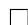

# References

[1] Akshay Agrawal, Brandon Amos, Shane Barratt, Stephen Boyd, Steven Diamond, and J Zico Kolter. Differentiable convex optimization layers. Advances in neural information processing systems, 32, 2019.   
[2] Brandon Amos and J. Zico Kolter. OptNet: Differentiable optimization as a layer in neural networks. In Doina Precup and Yee Whye Teh, editors, Proceedings of the 34th International Conference on Machine Learning, volume 70 of Proceedings of Machine Learning Research, pages 136–145. PMLR, 06–11 Aug 2017. URL https://proceedings.mlr.press/v70/amos17a.html.   
[3] Hassan T. Anis and Roy H. Kwon. End-to-end, decision-based, cardinality-constrained portfolio optimization. European Journal of Operational Research, 320(3):739–753, 2025. ISSN 0377-2217. doi: https://doi.org/10.1016/j.ejor.2024.08.030. URL https://www.sciencedirect.com/science/ article/pii/S0377221724006866.   
[4] Suleyman Basak and Georgy Chabakauri. Dynamic mean-variance asset allocation. The Review of Financial Studies, 23(8):2970–3016, 2010.   
[5] Dimitris Bertsimas and Ryan Cory-Wright. A scalable algorithm for sparse portfolio selection. INFORMS Journal on Computing, 34(3):1489–1511, 2022. doi: 10.1287/ijoc.2021.1127. URL https: //doi.org/10.1287/ijoc.2021.1127.

[6] Michael J Best and Robert R Grauer. On the sensitivity of mean-variance-efficient portfolios to changes in asset means: some analytical and computational results. The review of financial studies, 4(2):315–342, 1991.   
[7] Fischer Black and Robert Litterman. Global portfolio optimization. Financial analysts journal, 48 (5):28–43, 1992.   
[8] Mathieu Blondel, Quentin Berthet, Marco Cuturi, Roy Frostig, Stephan Hoyer, Felipe Llinares-L´opez, Fabian Pedregosa, and Jean-Philippe Vert. Efficient and modular implicit differentiation. Advances in neural information processing systems, 35:5230–5242, 2022.   
[9] Christian Bongiorno, Efstratios Manolakis, and Rosario Nunzio Mantegna. End-to-end large portfolio optimization for variance minimization with neural networks through covariance cleaning. arXiv preprint arXiv:2507.01918, 2025.   
[10] Stephen Boyd, Enzo Busseti, Steven Diamond, Ronald N. Kahn, Kwangmoo Koh, Peter Nystrup, and Jan Speth. Multi-period trading via convex optimization, 2017. URL https://arxiv.org/ abs/1705.00109.   
[11] Joshua Brodie, Ingrid Daubechies, Christine De Mol, Domenico Giannone, and Ignace Loris. Sparse and stable markowitz portfolios. Proceedings of the National Academy of Sciences, 106(30):12267– 12272, 2009.   
[12] Giorgio Costa and Garud N Iyengar. Distributionally robust end-to-end portfolio construction. Quantitative Finance, 23(10):1465–1482, 2023.   
[13] Tianxiang Cui, Nanjiang Du, Xiaoying Yang, and Shusheng Ding. Multi-period portfolio optimization using a deep reinforcement learning hyper-heuristic approach. Technological Forecasting and Social Change, 198:122944, 2024.   
[14] George B Dantzig and Gerd Infanger. Multi-stage stochastic linear programs for portfolio optimization. Annals of Operations Research, 45(1):59–76, 1993.   
[15] Victor DeMiguel, Lorenzo Garlappi, and Raman Uppal. Optimal versus naive diversification: How inefficient is the 1/n portfolio strategy? The review of Financial studies, 22(5):1915–1953, 2009.   
[16] Adam N Elmachtoub and Paul Grigas. Smart “predict, then optimize”. Management Science, 68 (1):9–26, 2022.   
[17] Javier Estrada. Mean-semivariance behavior: Downside risk and capital asset pricing. International Review of Economics & Finance, 16(2):169–185, 2007.   
[18] Nicolae Gˆarleanu and Lasse Heje Pedersen. Dynamic trading with predictable returns and transaction costs. The Journal of Finance, 68(6):2309–2340, 2013.   
[19] Nikolaus Hautsch and Stefan Voigt. Large-scale portfolio allocation under transaction costs and model uncertainty. Journal of Econometrics, 212(1):221–240, 2019.   
[20] Ravi Jagannathan and Tongshu Ma. Risk reduction in large portfolios: Why imposing the wrong constraints helps. The journal of finance, 58(4):1651–1683, 2003.   
[21] Yifu Jiang, Jose Olmo, and Majed Atwi. High-dimensional multi-period portfolio allocation using deep reinforcement learning. International Review of Economics & Finance, 98:103996, 2025.   
[22] Taesung Kim, Jinhee Kim, Yunwon Tae, Cheonbok Park, Jang-Ho Choi, and Jaegul Choo. Reversible instance normalization for accurate time-series forecasting against distribution shift. In International Conference on Learning Representations, 2022. URL https://openreview.net/forum? id=cGDAkQo1C0p.   
[23] Diederik P Kingma and Jimmy L Ba. Adam: A method for stochastic optimization. In International Conference on Learning Representations (ICLR), 2015.   
[24] Daniel Kinn. Reducing estimation risk in mean-variance portfolios with machine learning. arXiv preprint arXiv:1804.01764, 2018.

[25] Felix Kircher. Optimal portfolio selection with parameter estimation risks: Statistical modeling and empirical applications. PhD thesis, 2025.   
[26] Olivier Ledoit and Michael Wolf. Nonlinear shrinkage of the covariance matrix for portfolio selection: Markowitz meets goldilocks. The Review of Financial Studies, 30(12):4349–4388, 2017.   
[27] Junhyeong Lee, Inwoo Tae, and Yongjae Lee. Anatomy of machines for markowitz: Decision-focused learning for mean-variance portfolio optimization. arXiv preprint arXiv:2409.09684, 2024.   
[28] Edmond Lezmi, Thierry Roncalli, and Jiali Xu. Multi-period portfolio optimization. Available at SSRN 4078043, 2022.   
[29] Duan Li and Wan-Lung Ng. Optimal dynamic portfolio selection: Multiperiod mean-variance formulation. Mathematical finance, 10(3):387–406, 2000.   
[30] Xiaoyue Li, A Sinem Uysal, and John M Mulvey. Multi-period portfolio optimization using model predictive control with mean-variance and risk parity frameworks. European Journal of Operational Research, 299(3):1158–1176, 2022.   
[31] Zhe Li, Shiyi Qi, Yiduo Li, and Zenglin Xu. Revisiting long-term time series forecasting: An investigation on linear mapping, 2023. URL https://arxiv.org/abs/2305.10721.   
[32] Connor W. Magoon, Fengyu Yang, Noam Aigerman, and Shahar Z. Kovalsky. Differentiation through black-box quadratic programming solvers, 2025. URL https://arxiv.org/abs/2410.06324.   
[33] Harry Markowitz. Portfolio selection. The Journal of Finance, 7(1):77–91, 1952. ISSN 00221082, 15406261. URL http://www.jstor.org/stable/2975974.   
[34] Scott Murray, Yusen Xia, and Houping Xiao. Charting by machines. Journal of Financial Economics, 153:103791, 2024. ISSN 0304-405X. doi: https://doi.org/10.1016/j.jfineco.2024.103791. URL https: //www.sciencedirect.com/science/article/pii/S0304405X2400014X.   
[35] Arkadij Semenoviˇc Nemirovskij and David Borisovich Yudin. Problem complexity and method efficiency in optimization. 1983.   
[36] Razvan Oprisor and Roy Kwon. Multi-period portfolio optimization with investor views under regime switching. Journal of Risk and Financial Management, 14(1):3, 2020.   
[37] Jianming Pan, Zeqi Ye, Xiao Yang, Xu Yang, Weiqing Liu, Lewen Wang, and Jiang Bian. BPQP: A differentiable convex optimization framework for efficient end-to-end learning. In The Thirty-eighth Annual Conference on Neural Information Processing Systems, 2024. URL https://openreview. net/forum?id=VKKY3Uv7vi.   
[38] {A. Sinem} Uysal, Xiaoyue Li, and {John M.} Mulvey. End-to-end risk budgeting portfolio optimization with neural networks. Annals of Operations Research, 339(1-2):397–426, August 2024. ISSN 0254-5330. doi: 10.1007/s10479-023-05539-4.   
[39] Bo Wahlberg, Stephen Boyd, Mariette Annergren, and Yang Wang. An admm algorithm for a class of total variation regularized estimation problems*. IFAC Proceedings Volumes, 45(16):83– 88, 2012. ISSN 1474-6670. doi: https://doi.org/10.3182/20120711-3-BE-2027.00310. URL https: //www.sciencedirect.com/science/article/pii/S1474667015379325. 16th IFAC Symposium on System Identification.   
[40] Jiayang Yu and Kuo-Chu Chang. Neural network predictive modeling on dynamic portfolio management—a simulation-based portfolio optimization approach. Journal of Risk and Financial Management, 13(11):285, 2020.   
[41] Xun Yu Zhou and Duan Li. Continuous-time mean-variance portfolio selection: A stochastic lq framework. Applied Mathematics & Optimization, 42(1):19–33, 2000.